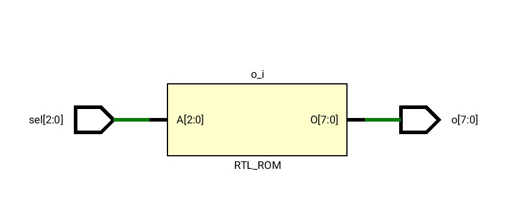

# Α.2

## Dataflow αρχιτεκτονική

Σε αυτήν την αρχιτεκτονική χρησιμοποιήθηκε η δομή `with ... select` ώστε να γίνει η αντιστοίχηση του σήματος εισόδου `sel` στο σήμα εξόδου `o`.
Παρακάτω φαίνεται το RTL σχηματικό που είναι μια ROM η οποία κάνει την αντιστοίχηση του αποκωδικοποιητή.


### Κώδικας VHDL

```vhdl
library IEEE;
use IEEE.std_logic_1164.all;

entity decoder8 is
        port (
                sel : in  std_logic_vector(2 downto 0);
                o  : out std_logic_vector(7 downto 0)
        );
end decoder8;

architecture decoder8_dataflow of decoder8 is
begin

	with sel select o <=
	"00000001" when "000",
	"00000010" when "001",
	"00000100" when "010",
	"00001000" when "011",
	"00010000" when "100",
	"00100000" when "101",
	"01000000" when "110",
	"10000000" when "111",
	"XXXXXXXX" when others;
end decoder8_dataflow;
```

## Behavioral αρχιτεκτονική

Επαναλαμβάνουμε τη σχεδίαση του αποκωδικοποιητή τώρα χρησιμοποιώντας behavioral αρχιτεκτονική.
Χρησιμοποιείται ένα `process` με sensitivity list το σήμα `sel` το οποίο έχει μια δομή `case`.
Η διαφορά με την dataflow αρχιτεκτονική είναι ότι τα statements τώρα είναι sequential.
Όλο το `process` περιγράφει sequential statements αλλά στο συγκεκριμένο παράδειγμα ούτως ή άλλως υπάρχει μόνο το `case`.
Το RTL σχηματικό είναι ακριβώς το ίδιο με το αντίστοιχο στην περίπτωση της dataflow αρχιτεκτονικής.




### Κώδικας VHDL

```vhdl
library IEEE;
use IEEE.std_logic_1164.all;

entity decoder8 is
        port (
                sel : in  std_logic_vector(2 downto 0);
                o  : out std_logic_vector(7 downto 0)
        );
end decoder8;

architecture decoder8_behavioral of decoder8 is
begin
	process(sel)
	begin
		case sel is
			when "000" => o <= "00000001"; 
			when "001" => o <= "00000010";
			when "010" => o <= "00000100";
			when "011" => o <= "00001000";
			when "100" => o <= "00010000";
			when "101" => o <= "00100000";
			when "110" => o <= "01000000";
			when "111" => o <= "10000000";
			when others => o <= (others => 'X');
		end case;
	end process;
end decoder8_behavioral;
```

## Testbench για τον `decoder8`

Το testbench για το module είναι γραμμένο σε behavioral αρχιτεκτονική και αποτελείται από ένα `for` loop που ελέγχει την έξοδο του κυκλώματος για όλες τις τιμές του `sel` από το `000` έως το `111`.

### Κώδικας VHDL

```vhdl
library ieee;
use ieee.std_logic_1164.all;
use ieee.numeric_std.all;
--use ieee.std_logic_arith.all;
--use IEEE.std_logic_unsigned.all;


entity testbench is
end testbench;

architecture tb of testbench is
    signal sel : std_logic_vector(2 downto 0);  -- inputs 
    signal o : std_logic_vector(7 downto 0);  -- outputs
begin
    UUT : entity work.decoder8 port map (sel => sel, o => o);
    process is
    begin
    sel <= "000";
    for i in 0 to 7 loop
		sel <= std_logic_vector(to_unsigned(i,3));
		wait for 10 ns;
		--assert o = std_logic_vector(shift_left(unsigned("00000001"),i)); 
	end loop;
	wait;
    end process;     
end tb ;
```

<!--  -->

# Β.2

Σχεδιάστηκε καταχωρητής ολίσθησης των 4 bits με παράλληλη φόρτωση.
Το σήμα `pl` καθορίζει την παράλληλη φόρτωση και έχει προεταιρότητα.
Αν δεν γίνεται παράλληλη φόρτωση τότε ανάλογα με το `en` γίνεται ολίσθηση.
Υπάρχουν ακόμα τα σήματα `si` και `so` και το `rst` που μηδενίζει ασύγχρονα τα flip-flops.
Το κύκλωμα έχει είσοδο ρολογιού `clk` στου οποίου στις θετικές ακμές γίνεται ενημέρωση του καταχωρητή.
Το `rst` επειδή είναι ασύγχρονο σήμα παρακάμπτει το ρολόι επειδή ο έλεγχος της τιμής του γίνεται έξω από τον έλεγχο για θετικές ακμές ρολογιού.

Προστέθηκε το σήμα `direction` το οποίο καθορίζει τη φορά της ολίσθησης.
Αν το `direction` είναι `0` τότε γίνεται δεξιά ολίσθηση ενώ αν είναι `1` γίνεται αριστερή ολίσθηση.
Ο έλεγχος για την τιμή του `direction` γίνεται στο `edge: process` με ένα `if` καθώς και στο τέλος του κώδικα για να καθοριστεί ποια τιμή θα πάρει το `so` (serial output).

Παρακάτω φαίνεται το RTL σχηματικό.
Η διαφορά του με το σχηματικό που δεν έχει το σήμα `direction` είναι ουσιαστικά 2 πολυπλέκτες οι οποίοι έχουν είσοδο επιλογής το `direction`.
Ο πρώτος καθορίζει το αν το `si` θα είναι το LSB (left shift) ή το MSB (right shift) και ο δεύτερος αν το `so` θα είναι το MSB (left shift) ή το LSB (right shift).


### Κώδικας VHDL

```vhdl
library IEEE;
use IEEE.std_logic_1164.all;
entity rshift_reg3 is
	port (
	clk,rst,si,en,pl,direction: in std_logic;
	din: in std_logic_vector(3 downto 0);
	so: out std_logic);
end rshift_reg3;

architecture rtl of rshift_reg3 is
	signal dff: std_logic_vector(3 downto 0);
begin
	edge: process (clk,rst)
	begin
		if rst='0' then
			dff<=(others=>'0');
		elsif clk'event and clk='1' then
			if pl='1' then
				dff<=din;
			elsif en='1' then
				if direction='0' then
					dff <= si & dff(3 downto 1);
				else
					dff <= dff(2 downto 0) & si;
				end if;
			end if;
		end if;
	end process;

	with direction select so <= 
		dff(0) when '0',
		dff(3) when '1',
		'X' when others;
end rtl;
```

## Testbench

Το testbench παράγει όλες τις δυνατές τιμές για όλα τα σήματα που μας ενδιαφέρουν (με τα nested for loops).
Επίσης έχει ένα `process` clocking το οποίο προσομοιώνει το ρολόι.
Σε κάθε `clock_period` το ρολόι είναι `1` στο πρώτο μισό της περιόδου και `0` στο δεύτερο μισό.

### Κώδικας VHDL
```vhdl
library ieee;
use ieee.std_logic_1164.all;
use ieee.numeric_std.all;

entity testbench_shift is
end testbench_shift;

architecture tb of testbench_shift is
	signal clk,rst,si,en,pl,direction,so: std_logic;
	signal din: std_logic_vector(3 downto 0);
	constant clock_period: time := 10 ns;
	constant clock_num: integer := 512;
begin
	mpampis: entity work.rshift_reg3  port map (clk => clk,rst => rst,si =>si,
	en=>en,pl => pl,direction => direction,so=>so,din=>din);

	process is
	begin
	en <= '1';
	rst <= '0';
	si <= '0';
	direction <= '0';
	pl <= '0';
	for i0 in 0 to 1 loop
		for i1 in 0 to 1 loop
			for i2 in 0 to 1 loop
				for i3 in 0 to 1 loop
					for i4 in 0 to 15 loop
						din <= std_logic_vector(to_unsigned(i4,4));
						wait for clock_period;
					end loop;
					pl <= not pl;
				end loop;
				direction <= not direction;
			end loop;
			si <= not si;
		end loop;
		rst <= not rst;
	end loop;
	wait;
	end process;

	clocking: process
	begin
		for i in 0 to clock_num loop
			clk <= '1', '0' after clock_period / 2;
			wait for clock_period;
		end loop;
	wait;
	end process;
end tb;
```

# Β.3

## Μετρητής χωρίς όριο

Το κύκλωμα έχει ρολόι `clk`, ασύγχρονο μηδενισμό `resetn`, `count_en` σήμα επίτρεψης.
Επίσης έχει έξοδο `sum` που είναι ο αριθμός και `cout` που είναι το κρατούμενο (δηλαδή δείχνει αν έχουμε φτάσει στον τελευταίο αριθμό ή όχι).

Προστέθηκε το σήμα `direction` που καθορίζει αν θα είναι up ή down η μέτρηση.
- Για `direction` `0` η μέτρηση γίνεται προς τα πάνω.
Όταν φτάσουμε στην τιμή 7 επιστρέφουμε στο 0.
- Για `direction` `1` η μέτρηση γίνεται προς τα κάτω.
Όταν φτάσουμε στην τιμή 0 επιστρέφουμε στο 7.

Ο έλεγχος για την τιμή του `direction` γίνεται με ένα `case`.

Ακολουθεί το RTL σχηματικό του κυκλώματος.
Η διαφορά του κυκλώματος αυτού από το κύκλωμα μόνο με up μέτρηση είναι ότι γίνεται και αφαίρεση εκτός από πρόσθεση και το αποτέλεσμα εξαρτάται από την τιμή του `direction`.
Επομένως συμπεραίνουμε ότι σε επίπεδο RTL λειτουργεί ορθά το κύκλωμα.


### Κώδικας VHDL
```vhdl
library IEEE;
use IEEE.std_logic_1164.all;
use IEEE.std_logic_unsigned.all;

entity count3_nolimit is
	port(clk,
	resetn,
	count_en,direction: in std_logic;
	sum: out std_logic_vector(2 downto 0);
	cout: out std_logic);
end;

architecture rtl_nolimit of count3_nolimit is
	signal count : std_logic_vector(2 downto 0);
begin
	process(clk, resetn)
	begin
		if resetn='0' then
			count <= (others=>'0');
		elsif rising_edge(clk) then
			if count_en = '1' then
				case direction is
					when '0' => 
						if count /= 7 then
							count <= count+1;
						else
							count<=(others=>'0');
						end if;
					when '1' => 
						if count = "000" then
							count <= "111";
						else
							count <= count-1;
						end if;
					when others => count <= (others => 'X');
				end case;
			end if;
		end if;
	end process;
	sum <= count;
	cout <= '1' when count=7 and count_en='1' else '0';
end;
```

## Μετρητής με όριο

Η περίγραφη του κυκλώματος με όριο είναι παρόμοια με την προηγούμενη.
Απλώς αντικαθιστούμε το `7` που ήταν το όριο (δηλαδή μεγαλύτερος επιτρεπόμενος αριθμός) με το σήμα εισόδου `limit` των 3 bits.

Ακολουθεί το RTL σχηματικό.
Το μόνο σημείο στο οποίο διαφέρει είναι η ύπαρξη του `limit` το οποίο καθορίζει αν θα γίνει επαναφορά από την αρχή του μετρήματος.
Στον μετρητή χωρίς όριο η τιμή του `limit` ήταν ουσιαστικά το `7` δηλαδή `111`.


### Κώδικας VHDL
```vhdl
library IEEE;
use IEEE.std_logic_1164.all;
use IEEE.std_logic_unsigned.all;

entity count3 is
	port( clk,
	resetn,
	count_en,direction: in std_logic;
	limit: in std_logic_vector(2 downto 0);
	sum: out std_logic_vector(2 downto 0);
	cout: out std_logic);
end;

architecture rtl_limit of count3 is
	signal count : std_logic_vector(2 downto 0);
begin
	process(clk, resetn)
	begin
		if resetn='0' then
			count <= (others=>'0');
		elsif rising_edge(clk) then
			if count_en = '1' then
				
				case direction is
						when '0' => 
							if count /= limit then
								count <= count+1;
							else
								count <=(others=>'0');
							end if;
						when '1' => 
							if count = "000" then
								count <= limit;
							else
								count <= count-1;
							end if;
						when others => count <= (others => 'X');
					end case;

			end if;
		end if;
	end process;
	sum <= count;
	cout <= '1' when count=7 and count_en='1' else '0';
end;
```

## Testbench για τον `counter`

Το testbench και πάλι περνάει από όλες τις τιμές με for loops και παράγει ένα ρολόι.

### Κώδικας VHDL
```vhdl
library ieee;
use ieee.std_logic_1164.all;
use ieee.numeric_std.all;

entity testbench_counter is
end testbench_counter;

architecture tb of testbench_counter is
	signal clk,resetn,count_en,direction,cout: std_logic;
	signal limit: std_logic_vector(2 downto 0);
	signal sum: std_logic_vector(2 downto 0);
	constant clock_period: time := 10 ns;
	constant clock_num: integer := 2048;
begin
	UUT: entity work.count3  port map (clk => clk,resetn => resetn,count_en=>count_en,
	direction=>direction,cout => cout,limit => limit, sum => sum);

	process is
	begin
	resetn <= '0';
	count_en <= '0';
	direction <= '0';
	for i0 in 0 to 1 loop
		for i1 in 0 to 1 loop
			for i2 in 0 to 1 loop
					for i3 in 0 to 7 loop
						limit <= std_logic_vector(to_unsigned(i3,3));
						for i4 in 0 to 10 loop
							wait for clock_period;
						end loop;
					end loop;
				direction <= not direction;
			end loop;
			count_en <= not count_en;
		end loop;
		resetn <= not resetn;
	end loop;
	wait;
	end process;

	clocking: process
	begin
		for i in 0 to clock_num loop
			clk <= '1', '0' after clock_period / 2;
			wait for clock_period;
		end loop;
	wait;
	end process;
end tb;
```