# Ερώτημα 1

Σε αυτό το ερώτημα υλοποιήθηκε συνδυαστικός ημιαθροιστής (`Half Adder`) με `dataflow` περιγραφή. 

## Κώδικας Ερωτήματος 
```vhdl
library IEEE;
use IEEE.STD_LOGIC_1164.ALL;

entity half_adder_dtf is
    Port ( A : in STD_LOGIC;
           B : in STD_LOGIC;
           S : out STD_LOGIC;
           CA : out STD_LOGIC);
end half_adder_dtf;

architecture Dataflow of half_adder_dtf is

begin

 S <= A xor B;
CA <= A and B; 

end Dataflow;
```
## Testbench 
```vhdl 
library IEEE;
use IEEE.STD_LOGIC_1164.ALL;
use IEEE.NUMERIC_STD.ALL;


entity testbench_ha_dtf is
 --    Port ( );
end testbench_ha_dtf;

architecture Behavioral of testbench_ha_dtf is

component half_adder_dtf is
  Port (A,B:in std_logic;
  S,CA: out std_logic );
end component;
--inputs
signal A: std_logic;
signal B: std_logic;
--outputs
signal CA : std_logic;
signal S : std_logic;

begin

uut: half_adder_dtf PORT MAP(A=>A,B=>B,CA=>CA,S=>S);
--Stimulus Process
stim_proc:process
begin
A<='0';
B<='0';
wait for 10 ns;
A<='0';
B<='1';

 wait for 10 ns;
A<='1';
B<='0';
 wait for 10 ns; 
 
A<='1';
B<='1';
 wait for 10 ns;

end process;

end Behavioral;
```

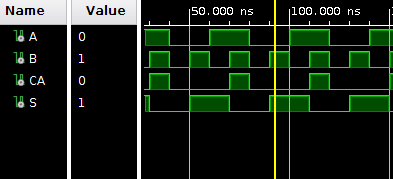

## RTL 


## Κρίσιμο Μονοπάτι 

Το κρίσιμο μονοπάτι είναι μεταξύ του `B` και του `S`

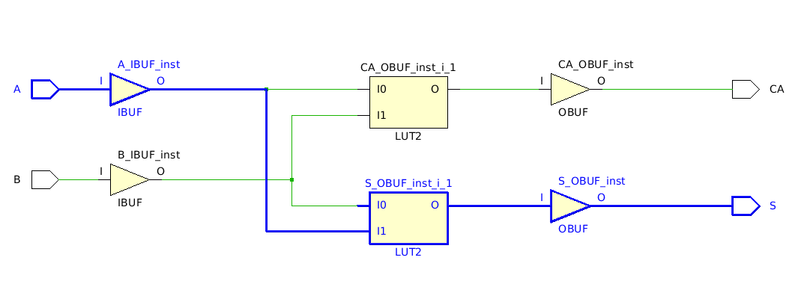

Η μέγιστη καθυστέρηση είναι **5.377ns** 

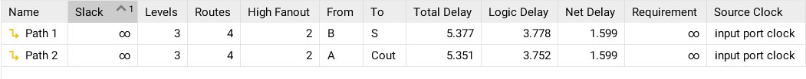

## Κατανάλωση Πόρων FPGA

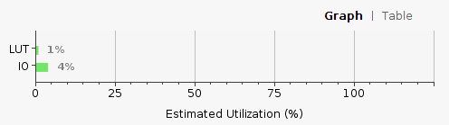 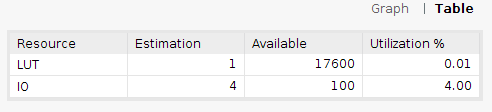

# Ερώτημα 2α

## Συνδυαστικό Κύκλωμα

Σε αυτό το ερώτημα κληθήκαμε να υλοποιήσουμε έναν πλήρη Αθροιστή (`Full Adder`) με Structural δομή βασισμένοι στη δομική μονάδα του ερωτήματος 1. Επιπλέον χρησιμοποιήθηκε και η υλοποίηση μιας πύλης `or` για να είμαστε απόλυτα συμβατοί με τη δημιουργία των επιμέρους entities και τη χρήση των `components` αυτών. 

## Κώδικας 

```vhdl 
library IEEE;
use IEEE.STD_LOGIC_1164.ALL;
use IEEE.NUMERIC_STD.ALL;


entity or_gate is
    Port ( X : in STD_LOGIC;
           Y : in STD_LOGIC;
           Z : out STD_LOGIC);
end or_gate;

architecture Behavioral of or_gate is

begin

Z <= X or Y;
end Behavioral;
```

```vhdl
library IEEE;
library xil_defaultlib;
use xil_defaultlib.ALL;
use IEEE.STD_LOGIC_1164.ALL;
use IEEE.NUMERIC_STD.ALL;

entity full_adder_structural is
    Port ( FA : in STD_LOGIC;
           FB : in STD_LOGIC;
           FC : in STD_LOGIC;
           FS : out STD_LOGIC;
           FCA : out STD_LOGIC);
end full_adder_structural;

architecture Structural of full_adder_structural is

component half_adder_dtf is

Port ( A,B : in STD_LOGIC;

       S,CA : out STD_LOGIC);

end component;


component or_gate is

Port ( X,Y: in STD_LOGIC;

         Z: out STD_LOGIC);

end component;


SIGNAL S0,S1,S2:STD_LOGIC;

begin

U1:half_adder_dtf PORT MAP(A=>FA,B=>FB,S=>S0,CA=>S1);

U2:half_adder_dtf PORT MAP(A=>S0,B=>FC,S=>FS,CA=>S2);

U3:or_gate PORT MAP(X=>S2,Y=>S1,Z=>FCA);

end Structural;
```
## Testbench

```vhdl
library IEEE;
use IEEE.STD_LOGIC_1164.ALL;

entity full_adder_str_tb is
end full_adder_str_tb;

architecture Behavioral of full_adder_str_tb is

component full_adder_structural is 
 Port(
 FA : in std_logic;
 FB : in std_logic;
 FC : in std_logic;
 FS : out std_logic;
 FCA : out std_logic
 );
 end component;
 --Inputs
 signal FA : std_logic := '0';
 signal FB : std_logic := '0';
 signal FC : std_logic := '0';
 --Outputs
 signal FS : std_logic;
 signal FCA : std_logic;
 
begin

-- Instantiate the Unit Under Test (UUT)
 uut: full_adder_structural PORT MAP (FA => FA,FB => FB,FC => FC,FS => FS,FCA => FCA);
 -- Stimulus process
 stim_proc: process
 begin
 
 wait for 100 ns; 
  -- insert stimulus here
  FA <= '1';
  FB <= '0';
  FC <= '0';
  wait for 10 ns;
  FA <= '0';
  FB <= '1';
  FC <= '0';
  wait for 10 ns;
  FA <= '1';
  FB <= '1';
  FC <= '0';
  wait for 10 ns;
  FA <= '0';
  FB <= '0';
  FC <= '1';
  wait for 10 ns;
  FA <= '1';
  FB <= '0';
  FC <= '1';
  wait for 10 ns;
  FA <= '0';
  FB <= '1';
  FC <= '1';
  wait for 10 ns;
  FA <= '1';
  FB <= '1';
  FC <= '1';
  wait for 10 ns;
  end process;
end Behavioral;
```
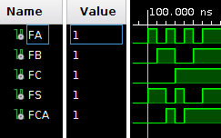

## RTL 

Ο κώδικας υλοποιεί τον πλήρη αθροιστή τη δομική μονάδα `half_adder_dtf` του ερωτήματος 1 και τη δομική μονάδα `or_gate`. To άθροισμα είναι η έξοδος του 2ου ημιαθροιστή ενώ το κρατούμενο `Cout` υπολογίζεται από τη λογική πράξη `or` μεταξύ του κρατούμενου εισόδου `FC` και του κρατούμενου εξόδου `CA` του 2ου ημιαθροιστή. 

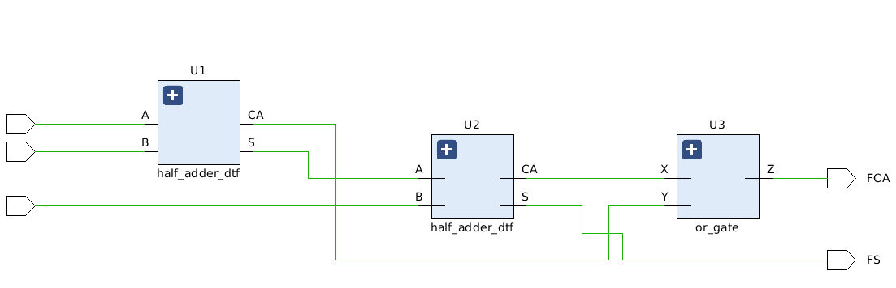

## Κρίσιμο Μονοπάτι 

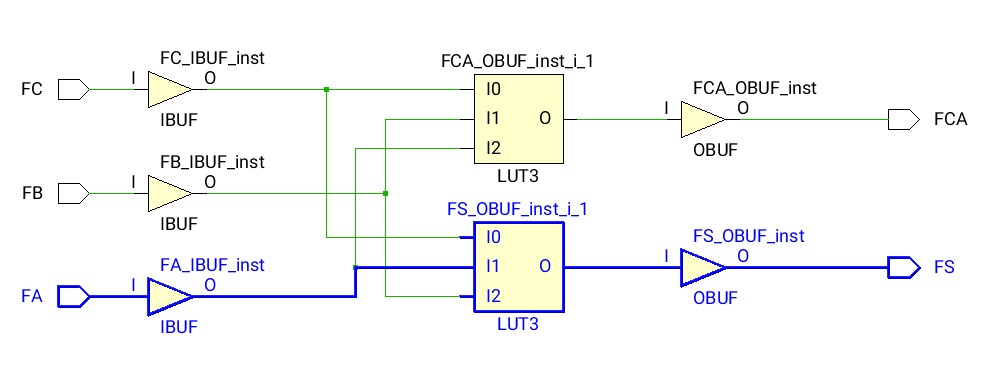 

Η μέγιστη καθυστέρηση είναι **5.377ns** 

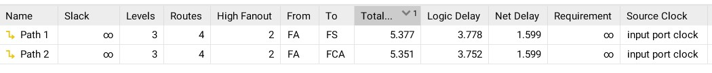 


## Κατανάλωση πόρων FPGA

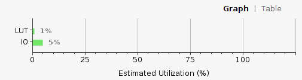
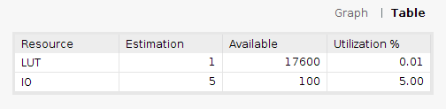

## Ακολουθιακό Κύκλωμα

Στόχος μας τώρα να υλοποιήσουμε έναν πλήρη αθροιστή με ρολόι με σύγχρονο reset, και structural περιγραφή. 

## Κώδικας 

```vhdl
library IEEE;
library xil_defaultlib;
use xil_defaultlib.ALL;
use IEEE.STD_LOGIC_1164.ALL;
use IEEE.NUMERIC_STD.ALL;

entity full_adder_structural is
    Port ( FA : in STD_LOGIC;
           FB : in STD_LOGIC;
           FC : in STD_LOGIC;
           clk : in STD_LOGIC;
           rst : in STD_LOGIC;
           FS : out STD_LOGIC;
           FCA : out STD_LOGIC);
end full_adder_structural;

architecture Structural of full_adder_structural is

component half_adder_dtf is

Port ( A,B : in STD_LOGIC;

       S,CA : out STD_LOGIC);

end component;


component or_gate is

Port ( X,Y: in STD_LOGIC;

         Z: out STD_LOGIC);

end component;


SIGNAL S0,S1,S2,S3,S4:STD_LOGIC;

begin

U1:half_adder_dtf PORT MAP(A=>FA,B=>FB,S=>S0,CA=>S1);

U2:half_adder_dtf PORT MAP(A=>S0,B=>FC,S=>S3,CA=>S2);

U3:or_gate PORT MAP(X=>S2,Y=>S1,Z=>S4);

process(clk)
       begin
   
           if (rising_edge(clk)) then
           if (rst = '1') then 
           FS<='0';
           FCA<='0';
           else
           FS<=S3;
           FCA<=S4;
           end if;
             
       end if;
    end process;
end Structural;
```
## Testbench 

```vhdl
library IEEE;
use IEEE.STD_LOGIC_1164.ALL;
use IEEE.NUMERIC_STD.ALL;


entity fa_seq_tb_str is
 --   Port ( );
end fa_seq_tb_str;

architecture Structural of fa_seq_tb_str is

component full_adder_structural is 
 Port(
 FA : in std_logic;
 FB : in std_logic;
 FC : in std_logic;
 clk : in STD_LOGIC;
 rst : in STD_LOGIC;
 FS : out std_logic;
 FCA : out std_logic
 );
 end component;
 --Inputs
 signal FA : std_logic := '0';
 signal FB : std_logic := '0';
 signal FC : std_logic := '0';
 signal clk : std_logic := '1';
 signal rst : std_logic := '1';
 --Outputs
 signal FS : std_logic;
 signal FCA : std_logic;
 
 constant clock_period: time := 10 ns;
 constant clock_num: integer := 1024;
   
begin

UUT: full_adder_structural port map (FA => FA,FB => FB,FC => FC,FS => FS,FCA => FCA, clk=>clk, rst=>rst);

-- Process for generating the clock
    clk <= not clk after clock_period / 2;

	process is

	begin
              
 rst <= '1';
 for i0 in 0 to 1 loop
    for i1 in 0 to 1 loop
        for i2 in 0 to 1 loop
            for i3 in 0 to 1 loop
                 FA <= not FA;
               wait for clock_period;
            end loop;
        FB <= not FB;
        end loop;
    FC <= not FC;
    end loop;
 rst <= not rst;
 end loop;
 wait;
	end process;

end Structural;
```
Όταν το `reset` = 1 τότε οι έξοδοι είναι 0. 

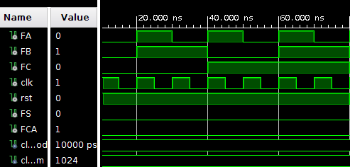

Όταν το `reset` γίνει 0 τότε οι έξοδοι λαμβάνουν τις αντίστοιχες τιμές τους ανάλογα με την είσοδο, μετά από έναν κύκλο καθυστέρησης.

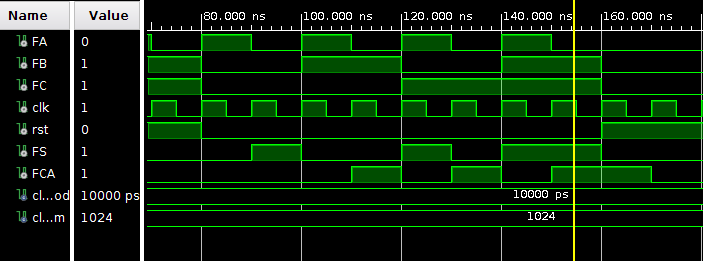

## RTL 

Το rtl σχηματικό του κυκλώματος παρουσιάζεται παρακάτω. 

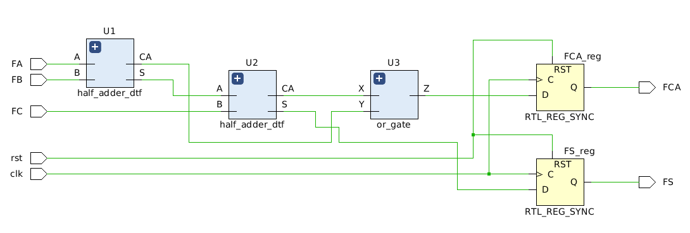

## Κρίσιμο Μονοπάτι 
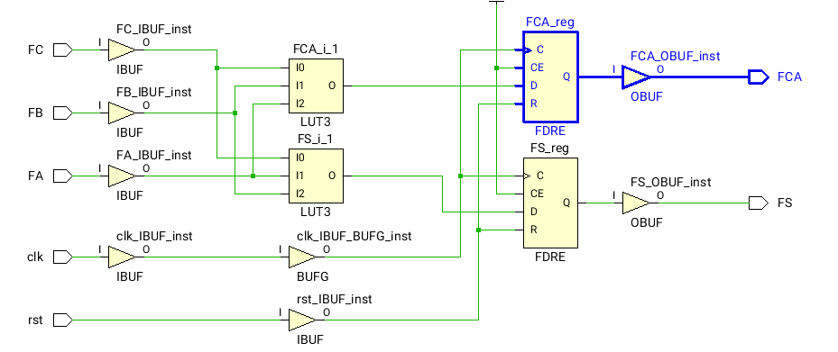

Μέγιστη καθυστέρηση: **4.076ns**
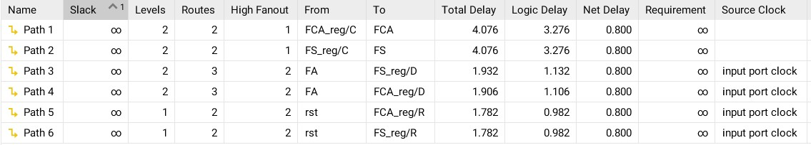

## Κατανάλωση πόρων FPGA 

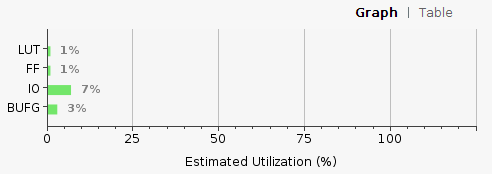
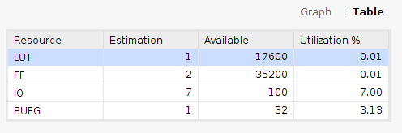

# Ερώτημα 2β

## Συνδυαστικό κύκλωμα 

Σ αυτό το ερώτημα καλούμαστε να υλοποιήσουμε και πάλι έναν πλήρη αθροιστή, αυτή τη φορά με behavioral περιγραφή και χρήση του τελεστή '+' 

## Κώδικας 

```vhdl 

library IEEE;
use IEEE.STD_LOGIC_1164.ALL;
use IEEE.STD_LOGIC_unsigned.ALL;
use IEEE.NUMERIC_STD.ALL;


entity full_adder_bhv is
    Port ( A : in STD_LOGIC;
           B : in STD_LOGIC;
           Cin : in STD_LOGIC;
           S : out STD_LOGIC;
           Cout : out STD_LOGIC);
end full_adder_bhv;

architecture Behavioral of full_adder_bhv is

signal tmp: std_logic_vector(1 downto 0);
 begin  
   process(A,B,Cin)
   begin 
 tmp <= ('0'& A) + ('0'& B) +('0'& Cin) ;
   end process;
   S <= tmp(0);
   Cout <= tmp(1);

end Behavioral;
```

## Testbench 

```vhdl 

library IEEE;
use IEEE.STD_LOGIC_1164.ALL;
use IEEE.NUMERIC_STD.ALL;

entity full_adder_bhv_tb is
  --  Port ( );
end full_adder_bhv_tb;

architecture Behavioral of full_adder_bhv_tb is

component full_adder_bhv
   port( 
  A, B, Cin : in std_logic;  
  S, Cout : out std_logic
  );  
 end component; 
 signal A,B,Cin: std_logic:='0';
 signal S,Cout: std_logic;

begin

bhv_full_adder: full_adder_bhv port map 
   (
    A => A,
    B => B,
    Cin => Cin,
    S => S,
    Cout => Cout 
   );
  process
  begin
   A <= '1';
   B <= '1';
   Cin <= '1';
   wait for 50 ns; 
   A <= '1';
   B <= '1';
   Cin <= '0';
   wait for 50 ns; 
   A <= '1';
   B <= '0';
   Cin <= '1';
   wait for 50 ns;
   A <= '0';
   B <= '0';
   Cin <= '0';
   wait for 50 ns;
   A <= '0';
   B <= '0';
   Cin <= '1';
   wait for 50 ns;   
   A <= '0';
   B <= '1';
   Cin <= '0';
   wait for 50 ns;
   A <= '0';
   B <= '1';
   Cin <= '1';
   wait for 50 ns;
   A <= '1';
   B <= '0';
   Cin <= '0';
   wait for 50 ns;
  
  end process;
  
end Behavioral;
``` 
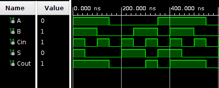 

## RTL 
Στο σχήμα είναι ξεκάθαρη η χρήση του τελεστή '+'.

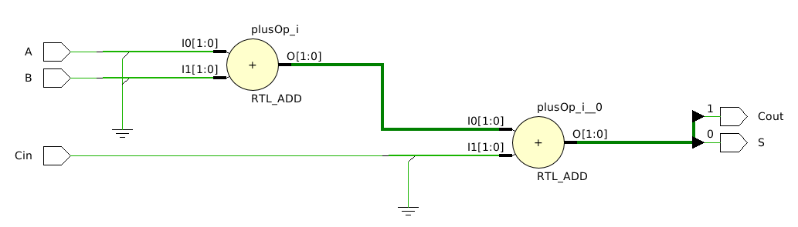

## Κρίσιμο Μονοπάτι 

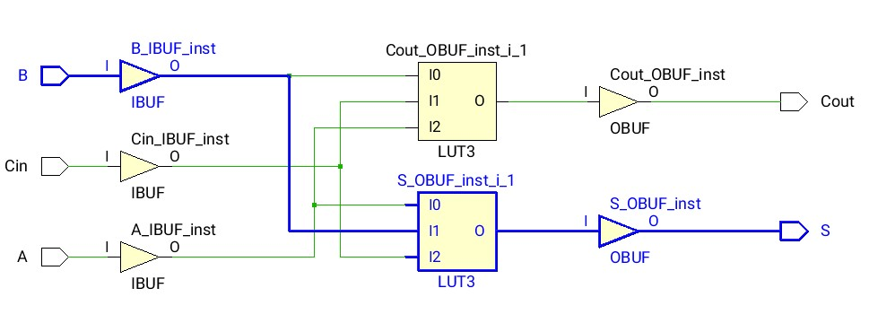

Η μέγιστη καθυστέρηση είναι **5.377 ns**
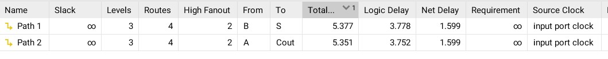

## Κατανάλωση πόρων FPGA

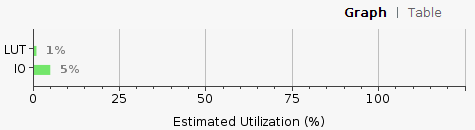
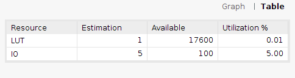

## Ακολουθιακό Κύκλωμα 
Όμοίως με το αντίστοιχο ερώτημα του 2α καλούμαστε να υλοποιήσουμε ακολουθιακό κύκλωμα πλήρους αθροιστή με σύγχρονο reset, αυτή τη φορά με behavioral περιγραφή. 

## Κώδικας 

```vhdl
library IEEE;

use IEEE.STD_LOGIC_1164.ALL;

use ieee.numeric_std.all;

use ieee.std_logic_unsigned.all;


entity fa_bhv_s is

    Port ( A : in STD_LOGIC;
           B : in STD_LOGIC;
           Cin : in STD_LOGIC;
           clk : in STD_LOGIC;
           rst : in STD_LOGIC;
           S : out STD_LOGIC;
           Cout : out STD_LOGIC);

end fa_bhv_s;

architecture Behavioral of fa_bhv_s is


signal tmp : std_logic_vector(1 downto 0);
begin
    process(clk)
    
       begin
   
           if (rising_edge(clk)) then
           if (rst = '1') then 
           tmp(0) <= '0';
           tmp(1) <= '0';
           else
            tmp <= ('0'& A) + ('0'& B) +('0'& Cin);
           end if;
             
       end if;
    end process;
    
        S <= tmp(0);
     Cout <= tmp(1);
end Behavioral;
```
## Testbench 
```vhdl
library IEEE;
use IEEE.STD_LOGIC_1164.ALL;
use IEEE.NUMERIC_STD.ALL;


entity fa_seq_tb_bhv is
 --   Port ( );
end fa_seq_tb_bhv;

architecture Behavioral of fa_seq_tb_bhv is

component fa_bhv_s
   port( 
  A, B, Cin,clk,rst : in std_logic;  
  S, Cout : out std_logic
  );  
 end component; 
 signal A,B,Cin,rst: std_logic:='0';
 signal clk: std_logic:='1';
 signal S,Cout: std_logic;
 
 constant clock_period: time := 10 ns;
 constant clock_num: integer := 1024;
   
begin

UUT: fa_bhv_s port map (A=>A, B=>B, Cin=>Cin, S=>S, Cout=>Cout, clk=>clk, rst=>rst);

-- Process for generating the clock
    clk <= not clk after clock_period / 2;

	process is

	begin
              
 rst <= '1';
 for i0 in 0 to 1 loop
    for i1 in 0 to 1 loop
        for i2 in 0 to 1 loop
            for i3 in 0 to 1 loop
                 A <= not A;
               wait for clock_period;
            end loop;
        B <= not B;
        end loop;
    Cin <= not Cin;
    end loop;
 rst <= not rst;
 end loop;
 wait;
	end process;

end Behavioral;
```
Τα αποτελέσματα είναι ίδια ένα προς ένα με αυτά του ερωτήματος 2α του ακολουθιακού κυκλώματος.

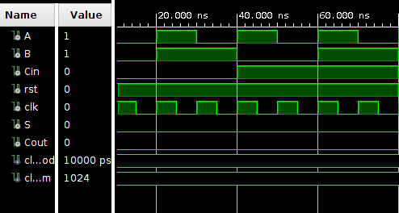
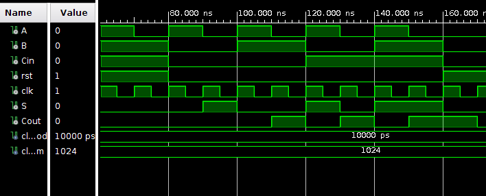

## RTL 

Στο rtl σχηματικό φαίνεται και πάλι η χρήση του τελεστή '+' αλλά και η χρήση ενός D flip-flop με σύγχρονο reset, το οποίο λειτουργεί ως καταχωρητής. 

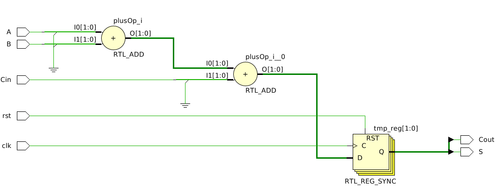

## Κρίσιμο Μονοπάτι 

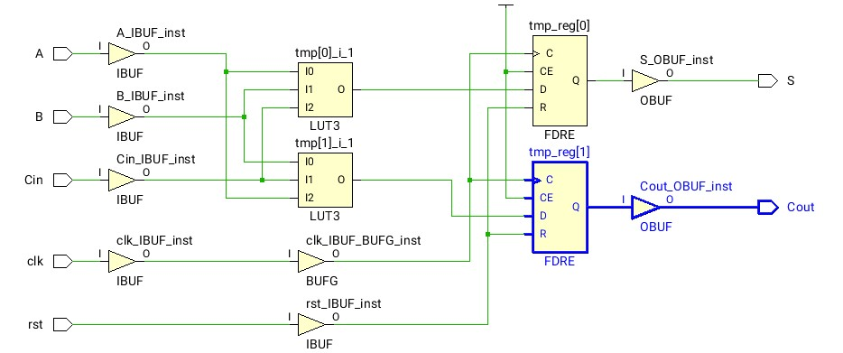

Η μέγιστη καθυστέρηση είναι **4.076 ns**
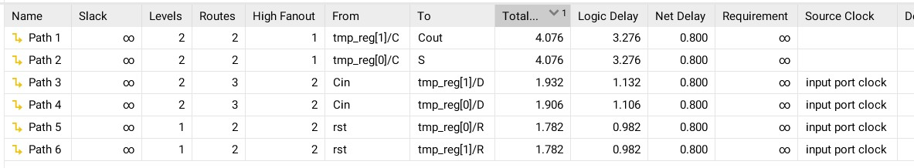

## Κατανάλωση πόρων FPGA

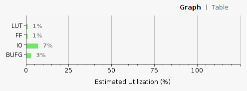
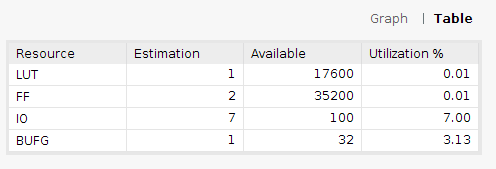

