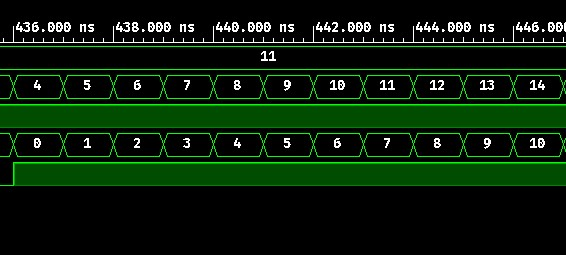
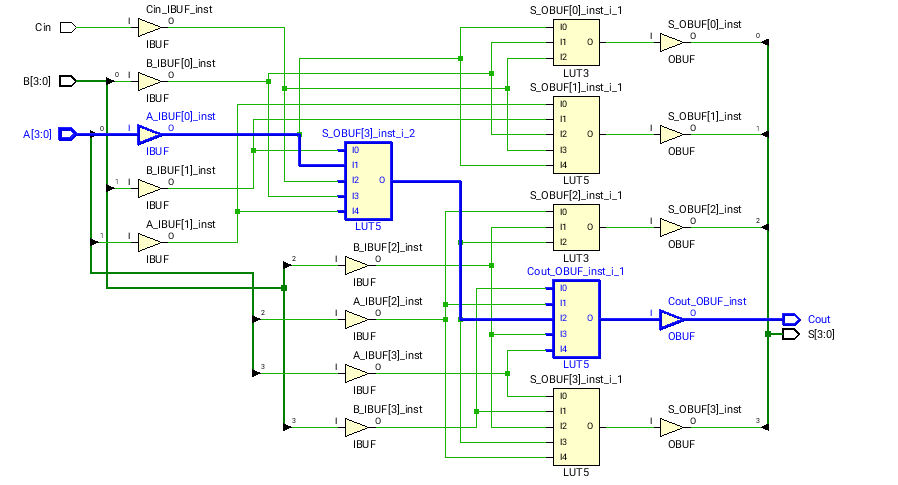
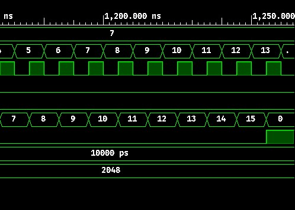
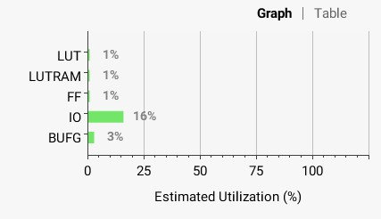
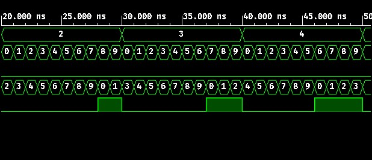
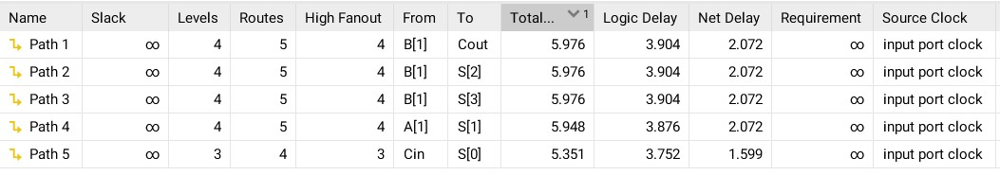

# Ερώτημα 3α

Ο κώδικας υλοποιεί τον αθροιστή με διάδοση κρατουμένου χρησιμοποιώντας τη δομική μονάδα `full_adder_bhv` του ερωτήματος 2b.
Χρησιμοποιούνται 4 Full Adders που ο κάθε ένας υπολογίζει ένα bit της εξόδου και το `Cout` του τροφοδοτεί το `Cin` του επόμενου.
Η λειτουργία αυτή φαίνεται ξεκάθαρα στο RTL σχηματικό.

## RTL


## Κώδικας 
```vhdl
library IEEE;
use IEEE.STD_LOGIC_1164.ALL;

entity rca_4bit_comb is
    Port ( A, B : in std_logic_vector(3 downto 0);
           Cin : in std_logic;
           S : out std_logic_vector(3 downto 0);
           Cout : out std_logic);
end rca_4bit_comb;

architecture structural of rca_4bit_comb is
component full_adder_bhv is
    Port ( A : in std_logic;
           B : in std_logic;
           Cin : in std_logic;
           S : out std_logic;
           Cout : out std_logic);
end component;
signal C: std_logic_vector(4 downto 0);
begin
    C(0) <= Cin;
    f1:for k in 0 to 3 generate
        u1:full_adder_bhv port map(A=>A(k), B=>B(k), Cin=>C(k), S=>S(k), Cout=>C(k+1));
    end generate f1;
    Cout <= C(4);
end structural;
```
## Testbench
```vhdl
library IEEE;
use IEEE.STD_LOGIC_1164.ALL;
use ieee.numeric_std.all;


entity rca_4bit_comb_tb is
end rca_4bit_comb_tb;

architecture Behavioral of rca_4bit_comb_tb is
-- inputs 
    signal A,B : std_logic_vector(3 downto 0);
    signal Cin : std_logic;
-- outputs
    signal S : std_logic_vector(3 downto 0);
    signal Cout : std_logic;
begin
    UUT: entity work.rca_4bit_comb port map (A=>A, B=>B, Cin=>Cin, S=>S, Cout=>Cout);
    process is
    begin
    A <= "0000";
    for Cval in std_logic range '0' to '1' loop
        for Aval in 0 to 15 loop
            for Bval in 0 to 15 loop
              A <= std_logic_vector(to_unsigned(Aval,4));
              B <= std_logic_vector(to_unsigned(Bval,4));
              Cin <= Cval;
              wait for 1 ns;
            end loop;
        end loop;
	end loop;
	wait;
    end process; 
end Behavioral;
```


## Κρίσιμο μονοπάτι

Το κρίσιμο μονοπάτι είναι αυτό μεταξύ της εισόδου A[0] και της εξόδου Cout.


Η μέγιστη καθυστέρηση είναι **5.970ns**.


## Κατανάλωση πόρων FPGA


# Ερώτημα 3β

Σε αυτό το ερώτημα το προηγούμενο κύκλωμα τροποποιείται έτσι ώστε να γίνει χρήση της τεχνικής Pipeline.
Υλοποιούνται 4 στάδια Pipeline, σε κάθε στάδιο υπολογίζεται ένα συγκεκριμένο bit της εξόδου (στο stage 0 το bit 0, στο stage 1 το bit 1 κλπ).
Αξιοποιείται η δομική μονάδα `full_adder_bhv_seq` για τον Full Adder, η οποία είναι ακολουθιακή.
Χρησιμοποιούνται σήματα για ενδιάμεσους registers τα οποία αποθηκεύουν και προωθούν στο επόμενο στάδιο είτε bits εισόδου είτε bits του αποτελέσματος.
Αυτά μετατρέπονται από το εργαλείο σε flip-flops.

Το κύκλωμα τροφοδοτείται σε κάθε κύκλο ρολογιού με διαφορετικές εισόδους.
Μετά από καθυστέρηση $T_{latency}=5$ κύκλους το αποτέλεσμα παρουσιάζεται στην έξοδο.
Η καθυστέρηση οφείλεται στα 4 στάδια του pipeline συν των registers που χρησιμοποιούνται στην έξοδο.
Μετά λοιπόν από τους 5 πρώτους κύκλους σε κάθε κύκλο υπάρχει και ένα νέο ορθό αποτέλεσμα που αντιστοιχεί στις εισόδους πριν 5 κύκλους.

## RTL


## Κώδικας 
```vhdl
library IEEE;
use IEEE.STD_LOGIC_1164.ALL;

entity rca_4bit_pipeline is
    port ( A, B : in std_logic_vector(3 downto 0);
           Cin, clk, rst : in std_logic;
           S : out std_logic_vector(3 downto 0);
           Cout : out std_logic);
end rca_4bit_pipeline;

architecture Structural of rca_4bit_pipeline is
component full_adder_bhv_seq is
    Port ( A : in std_logic;
           B : in std_logic;
           Cin : in std_logic;
           rst : in std_logic;
           clk : in std_logic;
           S : out std_logic;
           Cout : out std_logic);
end component;
-- Intermediate output S registers
signal s_reg0 : std_logic;
signal s_reg1 : std_logic_vector(1 downto 0);
signal s_reg2 : std_logic_vector(2 downto 0);
signal s_reg3 : std_logic_vector(3 downto 0);
-- Intermediate input A and B registers
signal a_reg0, b_reg0 : std_logic_vector(2 downto 0);
signal a_reg1, b_reg1 : std_logic_vector(1 downto 0);
signal a_reg2, b_reg2 : std_logic;
-- Intermediate carries 
signal c_regs : std_logic_vector(4 downto 0);
begin
-- PIPELINE

-- Stage 0
u0:full_adder_bhv_seq port map(
        A=>A(0),
        B=>B(0),
        Cin=>Cin,
        S=>s_reg0,
        Cout=>c_regs(0),
        rst=>rst,
        clk=>clk
    );
process(clk)
begin
if rising_edge(clk) then
    a_reg0(0) <= A(1);
    a_reg0(1) <= A(2);
    a_reg0(2) <= A(3);
    
    b_reg0(0) <= B(1);
    b_reg0(1) <= B(2);
    b_reg0(2) <= B(3);
end if;
end process;

-- Stage 1
u1:full_adder_bhv_seq port map(
        A=>a_reg0(0),
        B=>b_reg0(0),
        Cin=>c_regs(0),
        S=>s_reg1(1),
        Cout=>c_regs(1),
        rst=>rst,
        clk=>clk        
    );
process(clk)
begin
if rising_edge(clk) then
    s_reg1(0) <= s_reg0;
    
    a_reg1(0) <= a_reg0(1);
    a_reg1(1) <= a_reg0(2);
    
    b_reg1(0) <= b_reg0(1);
    b_reg1(1) <= b_reg0(2);
end if;
end process;

-- Stage 2
u2:full_adder_bhv_seq port map(
        A=>a_reg1(0),
        B=>b_reg1(0),
        Cin=>c_regs(1),
        S=>s_reg2(2),
        Cout=>c_regs(2),
        rst=>rst,
        clk=>clk
    );
process(clk)
begin
if rising_edge(clk) then
    s_reg2(0) <= s_reg1(0);
    s_reg2(1) <= s_reg1(1);
    
    a_reg2 <= a_reg1(1);
    
    b_reg2 <= b_reg1(1);
end if;
end process;

-- Stage 3
u3:full_adder_bhv_seq port map(
        A=>a_reg2,
        B=>b_reg2,
        Cin=>c_regs(2),
        S=>s_reg3(3),
        Cout=>c_regs(3),
        rst=>rst,
        clk=>clk
    );
process(clk)
begin
if rising_edge(clk) then
    s_reg3(0) <= s_reg2(0);
    s_reg3(1) <= s_reg2(1);
    s_reg3(2) <= s_reg2(2);
end if;
end process;

-- Output
process(clk)
begin
if rising_edge(clk) then
    S <= s_reg3;
    Cout <= c_regs(3);
end if;
end process;
end Structural;
```

## Testbench
```vhdl
library IEEE;
use IEEE.STD_LOGIC_1164.ALL;
use ieee.numeric_std.all;

entity rca_4bit_pipeline_tb is
end rca_4bit_pipeline_tb;

architecture Behavioral of rca_4bit_pipeline_tb is
-- inputs 
    signal A ,B : std_logic_vector(3 downto 0);
    signal clk, Cin, rst : std_logic;
-- outputs
    signal S : std_logic_vector(3 downto 0);
    signal Cout : std_logic;
    
    constant clock_period: time := 10 ns;
	constant clock_num: integer := 2048;
begin
    UUT: entity work.rca_4bit_pipeline port map (A=>A, B=>B, Cin=>Cin, S=>S, Cout=>Cout, rst=>rst, clk=>clk);

process begin
    rst <= '0';
    for Cval in std_logic range '0' to '1' loop
        for Aval in 0 to 15 loop
            for Bval in 0 to 15 loop
              A <= std_logic_vector(to_unsigned(Aval,4));
              B <= std_logic_vector(to_unsigned(Bval,4));
              Cin <= Cval;
              wait for clock_period;
            end loop;
        end loop;
	end loop;
    wait;
end process;

clocking: process
	begin
		for i in 0 to clock_num loop
			clk <= '0', '1' after clock_period / 2;
			wait for clock_period;
		end loop;
	wait;
	end process;
end Behavioral;
```

*Πέντε πρώτοι κύκλοι:*


*Αργότερα κατά την προσομοίωση:*



## Κρίσιμο μονοπάτι

Το κρίσιμο μονοπάτι είναι αυτό μεταξύ του register Cout_reg και της εξόδου Cout


Η μέγιστη καθυστέρηση είναι **4.076ns**.


## Κατανάλωση πόρων FPGA





# Ερώτημα 4

Ο αθροιστής BCD υλοποιείται χρησιμοποιώντας δύο συνδυαστικούς RCA (ερώτημα 3a) και επιπλέον συνδυαστική λογική (πύλες AND και OR).
Αρχικά γίνεται η πρόσθεση των δύο BCD ψηφίων (πρώτος RCA).
Στη συνέχεια, αν το ψηφίο που προκύπτει είναι μεγαλύτερο από 9 τότε στον δυαδικό αριθμό προστίθεται το 6 (με τον δεύτερο RCA) και προκύπτει το τελικό αποτέλεσμα που μπορεί να έχει και κρατούμενο.

## RTL


## Κώδικας 
```vhdl
library IEEE;
use IEEE.STD_LOGIC_1164.ALL;

-- Uncomment the following library declaration if using
-- arithmetic functions with Signed or Unsigned values
--use IEEE.NUMERIC_STD.ALL;

-- Uncomment the following library declaration if instantiating
-- any Xilinx leaf cells in this code.
--library UNISIM;
--use UNISIM.VComponents.all;


entity AND2 is
    PORT (A: in STD_LOGIC;
        B: in STD_LOGIC;
        AnB: out STD_LOGIC);
end AND2;

architecture trivial of AND2 is
begin
    AnB <= A and B;
end trivial;

library IEEE;
use IEEE.STD_LOGIC_1164.ALL;

entity OR3 is
    PORT (A: in STD_LOGIC;
        B: in STD_LOGIC;
        C: in STD_LOGIC;
        AoBoC: out STD_LOGIC);
end OR3;

architecture trivial of OR3 is
begin
    AoBoC <= A or B or C;
end trivial;

library IEEE;
use IEEE.STD_LOGIC_1164.ALL;

entity BCD_comb is
    Port ( A : in STD_LOGIC_VECTOR (3 downto 0);
           B : in STD_LOGIC_VECTOR (3 downto 0);
           Cin: in STD_LOGIC;
           S : out STD_LOGIC_VECTOR (3 downto 0);
           Cout : out STD_LOGIC);
end BCD_comb;

architecture structural of BCD_comb is

signal sum: std_logic_vector(3 downto 0);
signal Cint: std_logic;
signal o1,o2,o3:std_logic;
signal int_cout: std_logic;

begin
    adder1: entity work.rca_4bit_comb port map(A=>A,B=>B,Cin=>Cin,S=>sum,Cout=>int_cout);
    u1: entity work.AND2 port map(A=>sum(3),B=>sum(2),AnB=>o1);
    u2: entity work.AND2 port map(A=>sum(3),B=>sum(1),AnB=>o2);
    u3: entity work.OR3 port map(A=>o1,B=>o2,C=>int_cout,AoBoC=>Cint);
    adder2: entity work.rca_4bit_comb port map(A=>sum,B(3)=> '0',B(2)=>Cint,B(1)=>Cint,B(0)=>'0',Cin=>'0',S=>S);
    Cout <= Cint;
end structural;
```
## Testbench
```vhdl
library IEEE;
use IEEE.STD_LOGIC_1164.ALL;
use ieee.numeric_std.all;


entity bcd_FA_tb is
end bcd_FA_tb;

architecture Behavioral of bcd_FA_tb is
-- inputs 
    signal A,B : std_logic_vector(3 downto 0);
    signal Cin : std_logic;
-- outputs
    signal S : std_logic_vector(3 downto 0);
    signal Cout : std_logic;
begin
    UUT: entity work.BCD_comb port map (A=>A, B=>B, Cin=>Cin, S=>S, Cout=>Cout);
    process is
    begin
    for Cval in std_logic range '0' to '1' loop
        for Aval in 0 to 9 loop
            for Bval in 0 to 9 loop
              A <= std_logic_vector(to_unsigned(Aval,4));
              B <= std_logic_vector(to_unsigned(Bval,4));
              Cin <= Cval;
              wait for 1 ns;
            end loop;
        end loop;
	end loop;
	wait;
    end process; 
end Behavioral;
```


## Κρίσιμο μονοπάτι

Το κρίσιμο μονοπάτι είναι αυτό μεταξύ της εισόδου B[1] και της εξόδου Cout.


Η μέγιστη καθυστέρηση είναι **5.976ns**.


## Κατανάλωση πόρων FPGA


