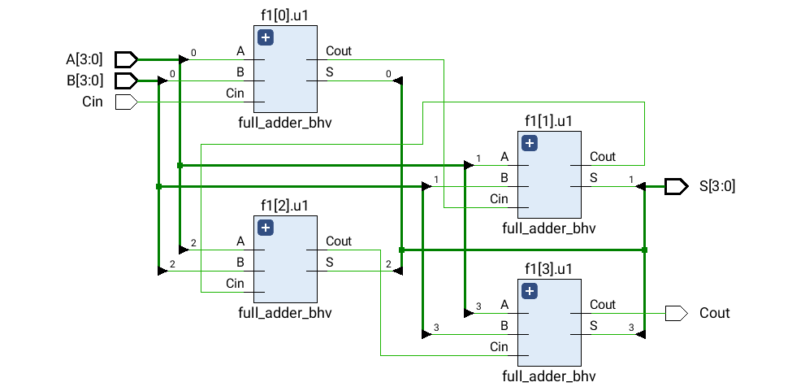
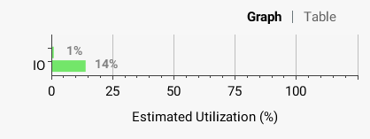
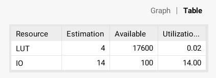

# Ερώτημα 3α

## RTL


## Κώδικας 
```vhdl
library IEEE;
use IEEE.STD_LOGIC_1164.ALL;

entity rca_4bit_comb is
    Port ( A, B : in std_logic_vector(3 downto 0);
           Cin : in std_logic;
           S : out std_logic_vector(3 downto 0);
           Cout : out std_logic);
end rca_4bit_comb;

architecture structural of rca_4bit_comb is
component full_adder_bhv is
    Port ( A : in std_logic;
           B : in std_logic;
           Cin : in std_logic;
           S : out std_logic;
           Cout : out std_logic);
end component;
signal C: std_logic_vector(4 downto 0);
begin
    C(0) <= Cin;
    f1:for k in 0 to 3 generate
        u1:full_adder_bhv port map(A=>A(k), B=>B(k), Cin=>C(k), S=>S(k), Cout=>C(k+1));
    end generate f1;
    Cout <= C(4);
end structural;
```
## Testbench
```vhdl
library IEEE;
use IEEE.STD_LOGIC_1164.ALL;
use ieee.numeric_std.all;


entity rca_4bit_comb_tb is
end rca_4bit_comb_tb;

architecture Behavioral of rca_4bit_comb_tb is
-- inputs 
    signal A,B : std_logic_vector(3 downto 0);
    signal Cin : std_logic;
-- outputs
    signal S : std_logic_vector(3 downto 0);
    signal Cout : std_logic;
begin
    UUT: entity work.rca_4bit_comb port map (A=>A, B=>B, Cin=>Cin, S=>S, Cout=>Cout);
    process is
    begin
    A <= "0000";
    for Cval in std_logic range '0' to '1' loop
        for Aval in 0 to 15 loop
            for Bval in 0 to 15 loop
              A <= std_logic_vector(to_unsigned(Aval,4));
              B <= std_logic_vector(to_unsigned(Bval,4));
              Cin <= Cval;
              wait for 1 ns;
            end loop;
        end loop;
	end loop;
	wait;
    end process; 
end Behavioral;
```


## Κρίσιμο μονοπάτι

Το κρίσιμο μονοπάτι είναι αυτό μεταξύ της εισόδου A[0] και της εξόδου Cout.


Η μέγιστη καθυστέρηση είναι **5.970ns**.


## Κατανάλωση πόρων FPGA




# Ερώτημα 3β


# Ερώτημα 4