# Ερώτημα 1

Σε αυτό το ερώτημα υλοποιήθηκε συνδυαστικός ημιαθροιστής (`Half Adder`) με `dataflow` περιγραφή. 

## Κώδικας Ερωτήματος 
```vhdl
library IEEE;
use IEEE.STD_LOGIC_1164.ALL;

entity half_adder_dtf is
    Port ( A : in STD_LOGIC;
           B : in STD_LOGIC;
           S : out STD_LOGIC;
           CA : out STD_LOGIC);
end half_adder_dtf;

architecture Dataflow of half_adder_dtf is

begin

 S <= A xor B;
CA <= A and B; 

end Dataflow;
```
## Testbench 
```vhdl 
library IEEE;
use IEEE.STD_LOGIC_1164.ALL;
use IEEE.NUMERIC_STD.ALL;


entity testbench_ha_dtf is
 --    Port ( );
end testbench_ha_dtf;

architecture Behavioral of testbench_ha_dtf is

component half_adder_dtf is
  Port (A,B:in std_logic;
  S,CA: out std_logic );
end component;
--inputs
signal A: std_logic;
signal B: std_logic;
--outputs
signal CA : std_logic;
signal S : std_logic;

begin

uut: half_adder_dtf PORT MAP(A=>A,B=>B,CA=>CA,S=>S);
--Stimulus Process
stim_proc:process
begin
A<='0';
B<='0';
wait for 10 ns;
A<='0';
B<='1';

 wait for 10 ns;
A<='1';
B<='0';
 wait for 10 ns; 
 
A<='1';
B<='1';
 wait for 10 ns;

end process;

end Behavioral;
```


## RTL 


## Κρίσιμο Μονοπάτι 

Το κρίσιμο μονοπάτι είναι μεταξύ του `B` και του `S`


Η μέγιστη καθυστέρηση είναι **5.377ns** 

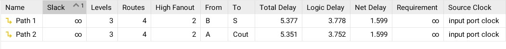

## Κατανάλωση Πόρων FPGA

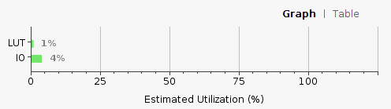 

# Ερώτημα 2α

## Συνδυαστικό Κύκλωμα

Σε αυτό το ερώτημα κληθήκαμε να υλοποιήσουμε έναν πλήρη Αθροιστή (`Full Adder`) με Structural δομή βασισμένοι στη δομική μονάδα του ερωτήματος 1. Επιπλέον χρησιμοποιήθηκε και η υλοποίηση μιας πύλης `or` για να είμαστε απόλυτα συμβατοί με τη δημιουργία των επιμέρους entities και τη χρήση των `components` αυτών. 

## Κώδικας 

```vhdl 
library IEEE;
use IEEE.STD_LOGIC_1164.ALL;
use IEEE.NUMERIC_STD.ALL;


entity or_gate is
    Port ( X : in STD_LOGIC;
           Y : in STD_LOGIC;
           Z : out STD_LOGIC);
end or_gate;

architecture Behavioral of or_gate is

begin

Z <= X or Y;
end Behavioral;
```

```vhdl
library IEEE;
library xil_defaultlib;
use xil_defaultlib.ALL;
use IEEE.STD_LOGIC_1164.ALL;
use IEEE.NUMERIC_STD.ALL;

entity full_adder_structural is
    Port ( FA : in STD_LOGIC;
           FB : in STD_LOGIC;
           FC : in STD_LOGIC;
           FS : out STD_LOGIC;
           FCA : out STD_LOGIC);
end full_adder_structural;

architecture Structural of full_adder_structural is

component half_adder_dtf is

Port ( A,B : in STD_LOGIC;

       S,CA : out STD_LOGIC);

end component;


component or_gate is

Port ( X,Y: in STD_LOGIC;

         Z: out STD_LOGIC);

end component;


SIGNAL S0,S1,S2:STD_LOGIC;

begin

U1:half_adder_dtf PORT MAP(A=>FA,B=>FB,S=>S0,CA=>S1);

U2:half_adder_dtf PORT MAP(A=>S0,B=>FC,S=>FS,CA=>S2);

U3:or_gate PORT MAP(X=>S2,Y=>S1,Z=>FCA);

end Structural;
```
## Testbench

```vhdl
library IEEE;
use IEEE.STD_LOGIC_1164.ALL;

entity full_adder_str_tb is
end full_adder_str_tb;

architecture Behavioral of full_adder_str_tb is

component full_adder_structural is 
 Port(
 FA : in std_logic;
 FB : in std_logic;
 FC : in std_logic;
 FS : out std_logic;
 FCA : out std_logic
 );
 end component;
 --Inputs
 signal FA : std_logic := '0';
 signal FB : std_logic := '0';
 signal FC : std_logic := '0';
 --Outputs
 signal FS : std_logic;
 signal FCA : std_logic;
 
begin

-- Instantiate the Unit Under Test (UUT)
 uut: full_adder_structural PORT MAP (FA => FA,FB => FB,FC => FC,FS => FS,FCA => FCA);
 -- Stimulus process
 stim_proc: process
 begin
 
 wait for 100 ns; 
  -- insert stimulus here
  FA <= '1';
  FB <= '0';
  FC <= '0';
  wait for 10 ns;
  FA <= '0';
  FB <= '1';
  FC <= '0';
  wait for 10 ns;
  FA <= '1';
  FB <= '1';
  FC <= '0';
  wait for 10 ns;
  FA <= '0';
  FB <= '0';
  FC <= '1';
  wait for 10 ns;
  FA <= '1';
  FB <= '0';
  FC <= '1';
  wait for 10 ns;
  FA <= '0';
  FB <= '1';
  FC <= '1';
  wait for 10 ns;
  FA <= '1';
  FB <= '1';
  FC <= '1';
  wait for 10 ns;
  end process;
end Behavioral;
```
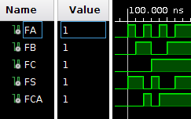

## RTL 

Ο κώδικας υλοποιεί τον πλήρη αθροιστή τη δομική μονάδα `half_adder_dtf` του ερωτήματος 1 και τη δομική μονάδα `or_gate`. To άθροισμα είναι η έξοδος του 2ου ημιαθροιστή ενώ το κρατούμενο `Cout` υπολογίζεται από τη λογική πράξη `or` μεταξύ του κρατούμενου εισόδου `FC` και του κρατούμενου εξόδου `CA` του 2ου ημιαθροιστή. 


## Κρίσιμο Μονοπάτι 

 

Η μέγιστη καθυστέρηση είναι **5.377ns** 

 


## Κατανάλωση πόρων FPGA


## Ακολουθιακό Κύκλωμα

Στόχος μας τώρα να υλοποιήσουμε έναν πλήρη αθροιστή με ρολόι με σύγχρονο reset, και structural περιγραφή. 

## Κώδικας 

```vhdl
library IEEE;
library xil_defaultlib;
use xil_defaultlib.ALL;
use IEEE.STD_LOGIC_1164.ALL;
use IEEE.NUMERIC_STD.ALL;

entity full_adder_structural is
    Port ( FA : in STD_LOGIC;
           FB : in STD_LOGIC;
           FC : in STD_LOGIC;
           clk : in STD_LOGIC;
           rst : in STD_LOGIC;
           FS : out STD_LOGIC;
           FCA : out STD_LOGIC);
end full_adder_structural;

architecture Structural of full_adder_structural is

component half_adder_dtf is

Port ( A,B : in STD_LOGIC;

       S,CA : out STD_LOGIC);

end component;


component or_gate is

Port ( X,Y: in STD_LOGIC;

         Z: out STD_LOGIC);

end component;


SIGNAL S0,S1,S2,S3,S4:STD_LOGIC;

begin

U1:half_adder_dtf PORT MAP(A=>FA,B=>FB,S=>S0,CA=>S1);

U2:half_adder_dtf PORT MAP(A=>S0,B=>FC,S=>S3,CA=>S2);

U3:or_gate PORT MAP(X=>S2,Y=>S1,Z=>S4);

process(clk)
       begin
   
           if (rising_edge(clk)) then
           if (rst = '1') then 
           FS<='0';
           FCA<='0';
           else
           FS<=S3;
           FCA<=S4;
           end if;
             
       end if;
    end process;
end Structural;
```
## Testbench 

```vhdl
library IEEE;
use IEEE.STD_LOGIC_1164.ALL;
use IEEE.NUMERIC_STD.ALL;


entity fa_seq_tb_str is
 --   Port ( );
end fa_seq_tb_str;

architecture Structural of fa_seq_tb_str is

component full_adder_structural is 
 Port(
 FA : in std_logic;
 FB : in std_logic;
 FC : in std_logic;
 clk : in STD_LOGIC;
 rst : in STD_LOGIC;
 FS : out std_logic;
 FCA : out std_logic
 );
 end component;
 --Inputs
 signal FA : std_logic := '0';
 signal FB : std_logic := '0';
 signal FC : std_logic := '0';
 signal clk : std_logic := '1';
 signal rst : std_logic := '1';
 --Outputs
 signal FS : std_logic;
 signal FCA : std_logic;
 
 constant clock_period: time := 10 ns;
 constant clock_num: integer := 1024;
   
begin

UUT: full_adder_structural port map (FA => FA,FB => FB,FC => FC,FS => FS,FCA => FCA, clk=>clk, rst=>rst);

-- Process for generating the clock
    clk <= not clk after clock_period / 2;

	process is

	begin
              
 rst <= '1';
 for i0 in 0 to 1 loop
    for i1 in 0 to 1 loop
        for i2 in 0 to 1 loop
            for i3 in 0 to 1 loop
                 FA <= not FA;
               wait for clock_period;
            end loop;
        FB <= not FB;
        end loop;
    FC <= not FC;
    end loop;
 rst <= not rst;
 end loop;
 wait;
	end process;

end Structural;
```
Όταν το `reset` = 1 τότε οι έξοδοι είναι 0. 


Όταν το `reset` γίνει 0 τότε οι έξοδοι λαμβάνουν τις αντίστοιχες τιμές τους ανάλογα με την είσοδο, μετά από έναν κύκλο καθυστέρησης.

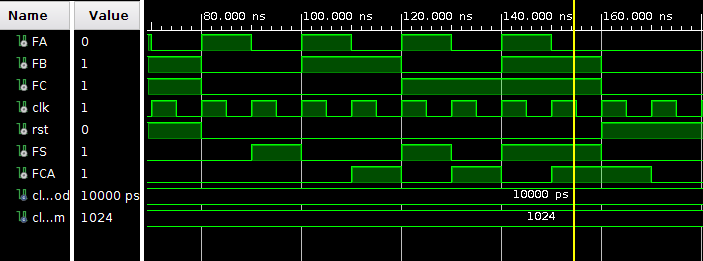

## RTL 

Το rtl σχηματικό του κυκλώματος παρουσιάζεται παρακάτω. 

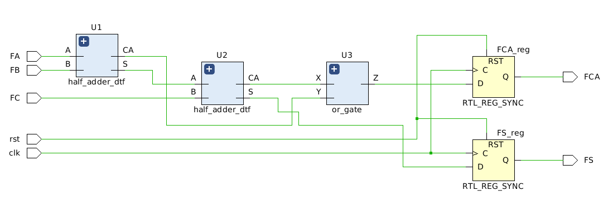

## Κρίσιμο Μονοπάτι 


Μέγιστη καθυστέρηση: **4.076ns**


## Κατανάλωση πόρων FPGA 

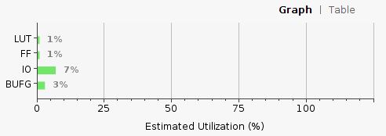


# Ερώτημα 2β

## Συνδυαστικό κύκλωμα 

Σ αυτό το ερώτημα καλούμαστε να υλοποιήσουμε και πάλι έναν πλήρη αθροιστή, αυτή τη φορά με behavioral περιγραφή και χρήση του τελεστή '+' 

## Κώδικας 

```vhdl 

library IEEE;
use IEEE.STD_LOGIC_1164.ALL;
use IEEE.STD_LOGIC_unsigned.ALL;
use IEEE.NUMERIC_STD.ALL;


entity full_adder_bhv is
    Port ( A : in STD_LOGIC;
           B : in STD_LOGIC;
           Cin : in STD_LOGIC;
           S : out STD_LOGIC;
           Cout : out STD_LOGIC);
end full_adder_bhv;

architecture Behavioral of full_adder_bhv is

signal tmp: std_logic_vector(1 downto 0);
 begin  
   process(A,B,Cin)
   begin 
 tmp <= ('0'& A) + ('0'& B) +('0'& Cin) ;
   end process;
   S <= tmp(0);
   Cout <= tmp(1);

end Behavioral;
```

## Testbench 

```vhdl 

library IEEE;
use IEEE.STD_LOGIC_1164.ALL;
use IEEE.NUMERIC_STD.ALL;

entity full_adder_bhv_tb is
  --  Port ( );
end full_adder_bhv_tb;

architecture Behavioral of full_adder_bhv_tb is

component full_adder_bhv
   port( 
  A, B, Cin : in std_logic;  
  S, Cout : out std_logic
  );  
 end component; 
 signal A,B,Cin: std_logic:='0';
 signal S,Cout: std_logic;

begin

bhv_full_adder: full_adder_bhv port map 
   (
    A => A,
    B => B,
    Cin => Cin,
    S => S,
    Cout => Cout 
   );
  process
  begin
   A <= '1';
   B <= '1';
   Cin <= '1';
   wait for 50 ns; 
   A <= '1';
   B <= '1';
   Cin <= '0';
   wait for 50 ns; 
   A <= '1';
   B <= '0';
   Cin <= '1';
   wait for 50 ns;
   A <= '0';
   B <= '0';
   Cin <= '0';
   wait for 50 ns;
   A <= '0';
   B <= '0';
   Cin <= '1';
   wait for 50 ns;   
   A <= '0';
   B <= '1';
   Cin <= '0';
   wait for 50 ns;
   A <= '0';
   B <= '1';
   Cin <= '1';
   wait for 50 ns;
   A <= '1';
   B <= '0';
   Cin <= '0';
   wait for 50 ns;
  
  end process;
  
end Behavioral;
``` 
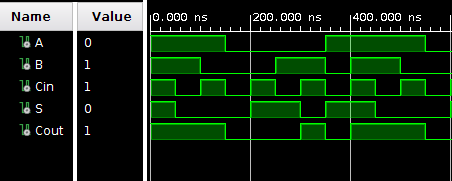 

## RTL 
Στο σχήμα είναι ξεκάθαρη η χρήση του τελεστή '+'.


## Κρίσιμο Μονοπάτι 

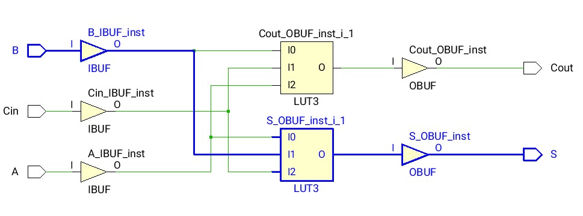

Η μέγιστη καθυστέρηση είναι **5.377 ns**
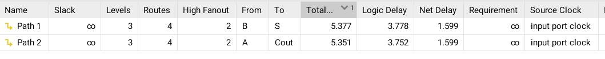

## Κατανάλωση πόρων FPGA

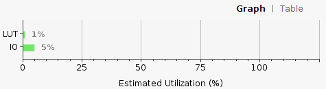
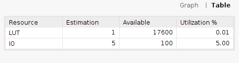

## Ακολουθιακό Κύκλωμα 
Όμοίως με το αντίστοιχο ερώτημα του 2α καλούμαστε να υλοποιήσουμε ακολουθιακό κύκλωμα πλήρους αθροιστή με σύγχρονο reset, αυτή τη φορά με behavioral περιγραφή. 

## Κώδικας 

```vhdl
library IEEE;

use IEEE.STD_LOGIC_1164.ALL;

use ieee.numeric_std.all;

use ieee.std_logic_unsigned.all;


entity fa_bhv_s is

    Port ( A : in STD_LOGIC;
           B : in STD_LOGIC;
           Cin : in STD_LOGIC;
           clk : in STD_LOGIC;
           rst : in STD_LOGIC;
           S : out STD_LOGIC;
           Cout : out STD_LOGIC);

end fa_bhv_s;

architecture Behavioral of fa_bhv_s is


signal tmp : std_logic_vector(1 downto 0);
begin
    process(clk)
    
       begin
   
           if (rising_edge(clk)) then
           if (rst = '1') then 
           tmp(0) <= '0';
           tmp(1) <= '0';
           else
            tmp <= ('0'& A) + ('0'& B) +('0'& Cin);
           end if;
             
       end if;
    end process;
    
        S <= tmp(0);
     Cout <= tmp(1);
end Behavioral;
```
## Testbench 
```vhdl
library IEEE;
use IEEE.STD_LOGIC_1164.ALL;
use IEEE.NUMERIC_STD.ALL;


entity fa_seq_tb_bhv is
 --   Port ( );
end fa_seq_tb_bhv;

architecture Behavioral of fa_seq_tb_bhv is

component fa_bhv_s
   port( 
  A, B, Cin,clk,rst : in std_logic;  
  S, Cout : out std_logic
  );  
 end component; 
 signal A,B,Cin,rst: std_logic:='0';
 signal clk: std_logic:='1';
 signal S,Cout: std_logic;
 
 constant clock_period: time := 10 ns;
 constant clock_num: integer := 1024;
   
begin

UUT: fa_bhv_s port map (A=>A, B=>B, Cin=>Cin, S=>S, Cout=>Cout, clk=>clk, rst=>rst);

-- Process for generating the clock
    clk <= not clk after clock_period / 2;

	process is

	begin
              
 rst <= '1';
 for i0 in 0 to 1 loop
    for i1 in 0 to 1 loop
        for i2 in 0 to 1 loop
            for i3 in 0 to 1 loop
                 A <= not A;
               wait for clock_period;
            end loop;
        B <= not B;
        end loop;
    Cin <= not Cin;
    end loop;
 rst <= not rst;
 end loop;
 wait;
	end process;

end Behavioral;
```
Τα αποτελέσματα είναι ίδια ένα προς ένα με αυτά του ερωτήματος 2α του ακολουθιακού κυκλώματος.


## RTL 

Στο rtl σχηματικό φαίνεται και πάλι η χρήση του τελεστή '+' αλλά και η χρήση ενός D flip-flop με σύγχρονο reset, το οποίο λειτουργεί ως καταχωρητής. 

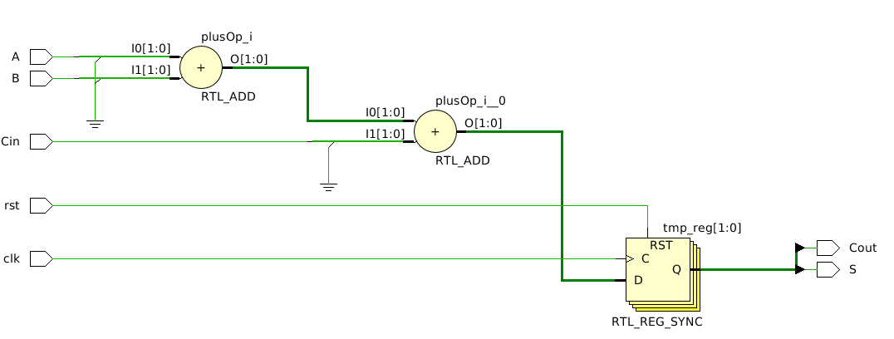

## Κρίσιμο Μονοπάτι 

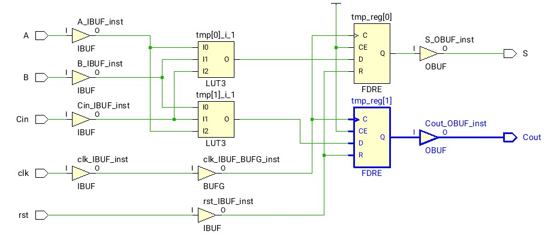

Η μέγιστη καθυστέρηση είναι **4.076 ns**


## Κατανάλωση πόρων FPGA


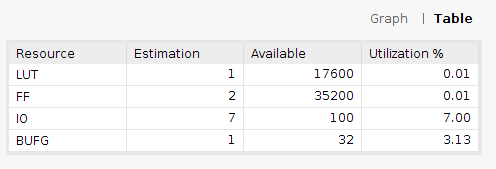

# Ερώτημα 3α

Ο κώδικας υλοποιεί τον αθροιστή με διάδοση κρατουμένου χρησιμοποιώντας τη δομική μονάδα `full_adder_bhv` του ερωτήματος 2b.
Χρησιμοποιούνται 4 Full Adders που ο κάθε ένας υπολογίζει ένα bit της εξόδου και το `Cout` του τροφοδοτεί το `Cin` του επόμενου.
Η λειτουργία αυτή φαίνεται ξεκάθαρα στο RTL σχηματικό.

## RTL


## Κώδικας 
```vhdl
library IEEE;
use IEEE.STD_LOGIC_1164.ALL;

entity rca_4bit_comb is
    Port ( A, B : in std_logic_vector(3 downto 0);
           Cin : in std_logic;
           S : out std_logic_vector(3 downto 0);
           Cout : out std_logic);
end rca_4bit_comb;

architecture structural of rca_4bit_comb is
component full_adder_bhv is
    Port ( A : in std_logic;
           B : in std_logic;
           Cin : in std_logic;
           S : out std_logic;
           Cout : out std_logic);
end component;
signal C: std_logic_vector(4 downto 0);
begin
    C(0) <= Cin;
    f1:for k in 0 to 3 generate
        u1:full_adder_bhv port map(A=>A(k), B=>B(k), Cin=>C(k), S=>S(k), Cout=>C(k+1));
    end generate f1;
    Cout <= C(4);
end structural;
```
## Testbench
```vhdl
library IEEE;
use IEEE.STD_LOGIC_1164.ALL;
use ieee.numeric_std.all;


entity rca_4bit_comb_tb is
end rca_4bit_comb_tb;

architecture Behavioral of rca_4bit_comb_tb is
-- inputs 
    signal A,B : std_logic_vector(3 downto 0);
    signal Cin : std_logic;
-- outputs
    signal S : std_logic_vector(3 downto 0);
    signal Cout : std_logic;
begin
    UUT: entity work.rca_4bit_comb port map (A=>A, B=>B, Cin=>Cin, S=>S, Cout=>Cout);
    process is
    begin
    A <= "0000";
    for Cval in std_logic range '0' to '1' loop
        for Aval in 0 to 15 loop
            for Bval in 0 to 15 loop
              A <= std_logic_vector(to_unsigned(Aval,4));
              B <= std_logic_vector(to_unsigned(Bval,4));
              Cin <= Cval;
              wait for 1 ns;
            end loop;
        end loop;
	end loop;
	wait;
    end process; 
end Behavioral;
```


## Κρίσιμο μονοπάτι

Το κρίσιμο μονοπάτι είναι αυτό μεταξύ της εισόδου A[0] και της εξόδου Cout.


Η μέγιστη καθυστέρηση είναι **5.970ns**.


## Κατανάλωση πόρων FPGA


# Ερώτημα 3β

Σε αυτό το ερώτημα το προηγούμενο κύκλωμα τροποποιείται έτσι ώστε να γίνει χρήση της τεχνικής Pipeline.
Υλοποιούνται 4 στάδια Pipeline, σε κάθε στάδιο υπολογίζεται ένα συγκεκριμένο bit της εξόδου (στο stage 0 το bit 0, στο stage 1 το bit 1 κλπ).
Αξιοποιείται η δομική μονάδα `full_adder_bhv_seq` για τον Full Adder, η οποία είναι ακολουθιακή.
Χρησιμοποιούνται σήματα για ενδιάμεσους registers τα οποία αποθηκεύουν και προωθούν στο επόμενο στάδιο είτε bits εισόδου είτε bits του αποτελέσματος.
Αυτά μετατρέπονται από το εργαλείο σε flip-flops.

Το κύκλωμα τροφοδοτείται σε κάθε κύκλο ρολογιού με διαφορετικές εισόδους.
Μετά από καθυστέρηση $T_{latency}=5$ κύκλους το αποτέλεσμα παρουσιάζεται στην έξοδο.
Η καθυστέρηση οφείλεται στα 4 στάδια του pipeline συν των registers που χρησιμοποιούνται στην έξοδο.
Μετά λοιπόν από τους 5 πρώτους κύκλους σε κάθε κύκλο υπάρχει και ένα νέο ορθό αποτέλεσμα που αντιστοιχεί στις εισόδους πριν 5 κύκλους.

## RTL


## Κώδικας 
```vhdl
library IEEE;
use IEEE.STD_LOGIC_1164.ALL;

entity rca_4bit_pipeline is
    port ( A, B : in std_logic_vector(3 downto 0);
           Cin, clk, rst : in std_logic;
           S : out std_logic_vector(3 downto 0);
           Cout : out std_logic);
end rca_4bit_pipeline;

architecture Structural of rca_4bit_pipeline is
component full_adder_bhv_seq is
    Port ( A : in std_logic;
           B : in std_logic;
           Cin : in std_logic;
           rst : in std_logic;
           clk : in std_logic;
           S : out std_logic;
           Cout : out std_logic);
end component;
-- Intermediate output S registers
signal s_reg0 : std_logic;
signal s_reg1 : std_logic_vector(1 downto 0);
signal s_reg2 : std_logic_vector(2 downto 0);
signal s_reg3 : std_logic_vector(3 downto 0);
-- Intermediate input A and B registers
signal a_reg0, b_reg0 : std_logic_vector(2 downto 0);
signal a_reg1, b_reg1 : std_logic_vector(1 downto 0);
signal a_reg2, b_reg2 : std_logic;
-- Intermediate carries 
signal c_regs : std_logic_vector(4 downto 0);
begin
-- PIPELINE

-- Stage 0
u0:full_adder_bhv_seq port map(
        A=>A(0),
        B=>B(0),
        Cin=>Cin,
        S=>s_reg0,
        Cout=>c_regs(0),
        rst=>rst,
        clk=>clk
    );
process(clk)
begin
if rising_edge(clk) then
    a_reg0(0) <= A(1);
    a_reg0(1) <= A(2);
    a_reg0(2) <= A(3);
    
    b_reg0(0) <= B(1);
    b_reg0(1) <= B(2);
    b_reg0(2) <= B(3);
end if;
end process;

-- Stage 1
u1:full_adder_bhv_seq port map(
        A=>a_reg0(0),
        B=>b_reg0(0),
        Cin=>c_regs(0),
        S=>s_reg1(1),
        Cout=>c_regs(1),
        rst=>rst,
        clk=>clk        
    );
process(clk)
begin
if rising_edge(clk) then
    s_reg1(0) <= s_reg0;
    
    a_reg1(0) <= a_reg0(1);
    a_reg1(1) <= a_reg0(2);
    
    b_reg1(0) <= b_reg0(1);
    b_reg1(1) <= b_reg0(2);
end if;
end process;

-- Stage 2
u2:full_adder_bhv_seq port map(
        A=>a_reg1(0),
        B=>b_reg1(0),
        Cin=>c_regs(1),
        S=>s_reg2(2),
        Cout=>c_regs(2),
        rst=>rst,
        clk=>clk
    );
process(clk)
begin
if rising_edge(clk) then
    s_reg2(0) <= s_reg1(0);
    s_reg2(1) <= s_reg1(1);
    
    a_reg2 <= a_reg1(1);
    
    b_reg2 <= b_reg1(1);
end if;
end process;

-- Stage 3
u3:full_adder_bhv_seq port map(
        A=>a_reg2,
        B=>b_reg2,
        Cin=>c_regs(2),
        S=>s_reg3(3),
        Cout=>c_regs(3),
        rst=>rst,
        clk=>clk
    );
process(clk)
begin
if rising_edge(clk) then
    s_reg3(0) <= s_reg2(0);
    s_reg3(1) <= s_reg2(1);
    s_reg3(2) <= s_reg2(2);
end if;
end process;

-- Output
process(clk)
begin
if rising_edge(clk) then
    S <= s_reg3;
    Cout <= c_regs(3);
end if;
end process;
end Structural;
```

## Testbench
```vhdl
library IEEE;
use IEEE.STD_LOGIC_1164.ALL;
use ieee.numeric_std.all;

entity rca_4bit_pipeline_tb is
end rca_4bit_pipeline_tb;

architecture Behavioral of rca_4bit_pipeline_tb is
-- inputs 
    signal A ,B : std_logic_vector(3 downto 0);
    signal clk, Cin, rst : std_logic;
-- outputs
    signal S : std_logic_vector(3 downto 0);
    signal Cout : std_logic;
    
    constant clock_period: time := 10 ns;
	constant clock_num: integer := 2048;
begin
    UUT: entity work.rca_4bit_pipeline port map (A=>A, B=>B, Cin=>Cin, S=>S, Cout=>Cout, rst=>rst, clk=>clk);

process begin
    rst <= '0';
    for Cval in std_logic range '0' to '1' loop
        for Aval in 0 to 15 loop
            for Bval in 0 to 15 loop
              A <= std_logic_vector(to_unsigned(Aval,4));
              B <= std_logic_vector(to_unsigned(Bval,4));
              Cin <= Cval;
              wait for clock_period;
            end loop;
        end loop;
	end loop;
    wait;
end process;

clocking: process
	begin
		for i in 0 to clock_num loop
			clk <= '0', '1' after clock_period / 2;
			wait for clock_period;
		end loop;
	wait;
	end process;
end Behavioral;
```

*Πέντε πρώτοι κύκλοι:*


*Αργότερα κατά την προσομοίωση:*


## Κρίσιμο μονοπάτι

Το κρίσιμο μονοπάτι είναι αυτό μεταξύ του register Cout_reg και της εξόδου Cout
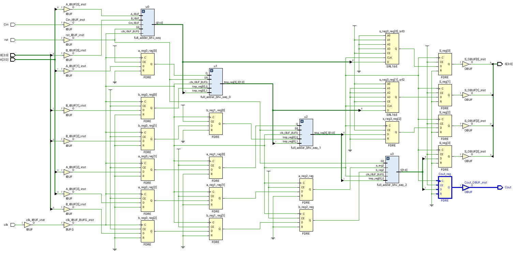

Η μέγιστη καθυστέρηση είναι **4.076ns**.


## Κατανάλωση πόρων FPGA


# Ερώτημα 4

Ο αθροιστής BCD υλοποιείται χρησιμοποιώντας δύο συνδυαστικούς RCA (ερώτημα 3a) και επιπλέον συνδυαστική λογική (πύλες AND και OR).
Αρχικά γίνεται η πρόσθεση των δύο BCD ψηφίων (πρώτος RCA).
Στη συνέχεια, αν το ψηφίο που προκύπτει είναι μεγαλύτερο από 9 τότε στον δυαδικό αριθμό προστίθεται το 6 (με τον δεύτερο RCA) και προκύπτει το τελικό αποτέλεσμα που μπορεί να έχει και κρατούμενο.

## RTL


## Κώδικας 
```vhdl
library IEEE;
use IEEE.STD_LOGIC_1164.ALL;

-- Uncomment the following library declaration if using
-- arithmetic functions with Signed or Unsigned values
--use IEEE.NUMERIC_STD.ALL;

-- Uncomment the following library declaration if instantiating
-- any Xilinx leaf cells in this code.
--library UNISIM;
--use UNISIM.VComponents.all;


entity AND2 is
    PORT (A: in STD_LOGIC;
        B: in STD_LOGIC;
        AnB: out STD_LOGIC);
end AND2;

architecture trivial of AND2 is
begin
    AnB <= A and B;
end trivial;

library IEEE;
use IEEE.STD_LOGIC_1164.ALL;

entity OR3 is
    PORT (A: in STD_LOGIC;
        B: in STD_LOGIC;
        C: in STD_LOGIC;
        AoBoC: out STD_LOGIC);
end OR3;

architecture trivial of OR3 is
begin
    AoBoC <= A or B or C;
end trivial;

library IEEE;
use IEEE.STD_LOGIC_1164.ALL;

entity BCD_comb is
    Port ( A : in STD_LOGIC_VECTOR (3 downto 0);
           B : in STD_LOGIC_VECTOR (3 downto 0);
           Cin: in STD_LOGIC;
           S : out STD_LOGIC_VECTOR (3 downto 0);
           Cout : out STD_LOGIC);
end BCD_comb;

architecture structural of BCD_comb is

signal sum: std_logic_vector(3 downto 0);
signal Cint: std_logic;
signal o1,o2,o3:std_logic;
signal int_cout: std_logic;

begin
    adder1: entity work.rca_4bit_comb port map(A=>A,B=>B,Cin=>Cin,S=>sum,Cout=>int_cout);
    u1: entity work.AND2 port map(A=>sum(3),B=>sum(2),AnB=>o1);
    u2: entity work.AND2 port map(A=>sum(3),B=>sum(1),AnB=>o2);
    u3: entity work.OR3 port map(A=>o1,B=>o2,C=>int_cout,AoBoC=>Cint);
    adder2: entity work.rca_4bit_comb port map(A=>sum,B(3)=> '0',B(2)=>Cint,B(1)=>Cint,B(0)=>'0',Cin=>'0',S=>S);
    Cout <= Cint;
end structural;
```
## Testbench
```vhdl
library IEEE;
use IEEE.STD_LOGIC_1164.ALL;
use ieee.numeric_std.all;


entity bcd_FA_tb is
end bcd_FA_tb;

architecture Behavioral of bcd_FA_tb is
-- inputs 
    signal A,B : std_logic_vector(3 downto 0);
    signal Cin : std_logic;
-- outputs
    signal S : std_logic_vector(3 downto 0);
    signal Cout : std_logic;
begin
    UUT: entity work.BCD_comb port map (A=>A, B=>B, Cin=>Cin, S=>S, Cout=>Cout);
    process is
    begin
    for Cval in std_logic range '0' to '1' loop
        for Aval in 0 to 9 loop
            for Bval in 0 to 9 loop
              A <= std_logic_vector(to_unsigned(Aval,4));
              B <= std_logic_vector(to_unsigned(Bval,4));
              Cin <= Cval;
              wait for 1 ns;
            end loop;
        end loop;
	end loop;
	wait;
    end process; 
end Behavioral;
```


## Κρίσιμο μονοπάτι

Το κρίσιμο μονοπάτι είναι αυτό μεταξύ της εισόδου B[1] και της εξόδου Cout.


Η μέγιστη καθυστέρηση είναι **5.976ns**.


## Κατανάλωση πόρων FPGA


# Ζήτημα 5

Η υλοποίηση του ερωτήματος έγινε με χρήση χρήση τεσσάρων bcd full adders του ερωτήματος 4.

### Κώδικας ερωτήματος

```vhdl
library ieee;
use ieee.std_logic_1164.all;
use ieee.numeric_std.all;

package bcd_arr_pkg is
    type bcd_arr is array(3 downto 0) of std_logic_vector(3 downto 0);
end package;

library ieee;
use ieee.std_logic_1164.all;
use ieee.numeric_std.all;
use work.bcd_arr_pkg.all;

entity bcd_4pa is
port(
    A, B: in bcd_arr;
    Cin : in std_logic;
    S: out bcd_arr;
    Cout : out std_logic
);
end entity;

architecture structural of bcd_4pa is
signal C: std_logic_vector(4 downto 0);
begin
    C(0) <= Cin;
    gen: for I in 0 to 3 generate
        adder: entity work.BCD_comb port map(
            A=>A(I),
            B=>B(I),
            Cin=>C(I),
            S=>S(I),
            Cout=>C(I+1)
        );
    end generate;
    Cout <= C(4);
end structural;
```

### Testbench ερωτήματος

```vhdl
library IEEE;
use IEEE.STD_LOGIC_1164.ALL;
use ieee.numeric_std.all;


entity bcd_4pa_tb is
end bcd_4pa_tb;
use work.bcd_arr_pkg.all;

architecture Behavioral of bcd_4pa_tb is
-- inputs 
    signal A, B : bcd_arr;
    signal Cin : std_logic;
-- outputs
    signal S : bcd_arr;
    signal Cout : std_logic;
begin
    UUT: entity work.bcd_4pa port map (A=>A, B=>B, Cin=>Cin, S=>S, Cout=>Cout);
    process is
    begin
    
    Cin <= '1';
    
    A(0) <= "1000";
    A(1) <= "1001";
    A(2) <= "0100";
    A(3) <= "0001";
    
    B(0) <= "1000";
    B(1) <= "0011";
    B(2) <= "0110";
    B(3) <= "0000";
    
    wait for 1 ns;
    
    Cin <= '0';
    
    A(0) <= "1001";
    A(1) <= "1000";
    A(2) <= "1000";
    A(3) <= "1000";
    
    B(0) <= "0101";
    B(1) <= "0101";
    B(2) <= "1001";
    B(3) <= "0101";
    
    wait for 1 ns;
    
    Cin <= '0';
    
    A(0) <= "0100";
    A(1) <= "0001";
    A(2) <= "0010";
    A(3) <= "0011";
    
    B(0) <= "0111";
    B(1) <= "1001";
    B(2) <= "1000";
    B(3) <= "0111";
    
    wait for 1 ns;
    
    Cin <= '1';
    
    A(0) <= "1001";
    A(1) <= "1001";
    A(2) <= "1001";
    A(3) <= "1001";
    
    B(0) <= "1001";
    B(1) <= "1001";
    B(2) <= "1001";
    B(3) <= "1001";
    
    
    wait;
    end process; 
end Behavioral;
```

### Σχηματικό

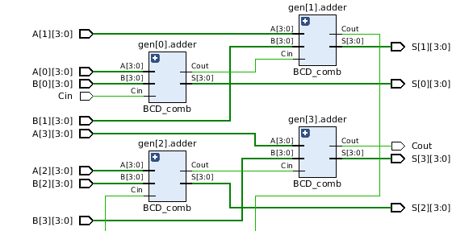

### Αποτελέσματα υλοποίησης

* LUTs **24**
* Καθυστέρηση 15.6 ns, Λογική 5.4 ns, Δικτύου 10.2 ns


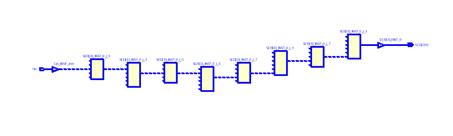

# Ζήτημα 6

Σε αυτό το ερώτημα ζητείται η σχεδίαση ενός συστολικού πολλαπλασιαστή με
διάδωση κρατουμένου.


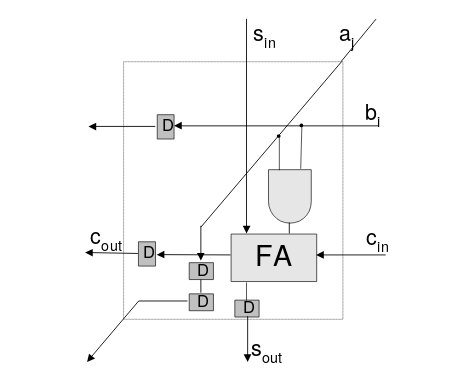

Για την απλοποίηση της υλοποίησης σχεδιάστηκε το παραμετρικό entity delay
που είναι ουσιαστικά ένας καταχωρητής ολίσθησης.

Κάτι που δε φαίνεται στο σχήμα είναι ότι στα τελευταία δομικά στοιχεία κάθε
γραμμής, απαιτείται ένα επιπλέον flip flop για καθυστέρηση επιπλέον ενός κύκλου (σύνολο 2). 

# Κώδικας ερωτήματος

```vhdl
-- Multiplier cell
--
-- (co,so) <= (a*b) + si + ci
-- (ao,bo) <= (ai,bi)
--
library IEEE;
use IEEE.std_logic_1164.all;

entity mul_cell is
	port
	(
		ai : in std_logic;
		bi : in std_logic;
		si : in std_logic;
		ci : in std_logic;
		clock: in std_logic;
		rst: in std_logic;
		ao : out std_logic;
		bo : out std_logic;
		so : out std_logic;
		co : out std_logic
		
	);
end mul_cell;

architecture dataflow of mul_cell is
	signal ab,a_o,a2_o,b_o,s_o,c_o : std_logic;
begin
	ab <= ai and bi;
	s_o <= ab xor si xor ci;
	c_o <= (ab and si) or (ab and ci) or (si and ci);
	a_o <= ai;
	b_o <= bi;

	-- flip flops
	process (clock)
	begin
		if rising_edge(clock) then
			if rst = '1' then
				so <= '0';
				co <= '0';
				a2_o <= '0';
				ao <= '0';
				bo <= '0';
			else
				so <= s_o;
				co <= c_o;
				a2_o <= a_o; -- 2 cycles delay for a
				ao <= a2_o;
				bo <= b_o;
			end if;
		end if;
	end process;
end dataflow;

library IEEE;
use IEEE.std_logic_1164.all;

entity delay is
generic
	(
		stages : positive := 4
	);
	port (
		input: in std_logic;
		clock: in std_logic;
		rst: in std_logic;
		output: out std_logic
	);
end delay;

architecture D of delay is
signal ff: std_logic_vector(stages-1 downto 0);
begin
	output <= ff(0);
	process(clock)
	begin
		if rising_edge(clock) then
			if rst = '1' then
				ff <= (others => '0');
			else
				ff(stages-1) <= input;
				for i in 0 to stages-2 loop
					ff(i) <= ff(i+1);
				end loop;
			end if;
		end if;
	end process;
end D;

-- Unsigned Parallel Carry-Propagate Multiplier
--
-- p <= a * b;
--

library IEEE;
use IEEE.std_logic_1164.all;
entity mul_u_cp is
	generic
	(
		NA : positive := 4; -- bits of multiplier
		NB : positive := 4 -- bits of multiplier
	);
	port
	(
		a : in std_logic_vector(NA-1 downto 0);
		b : in std_logic_vector(NB-1 downto 0);
		clock: std_logic;
		rst: std_logic;
		p : out std_logic_vector(NA+NB-1 downto 0)
	);
end mul_u_cp;

architecture structural of mul_u_cp is
	subtype a_word is std_logic_vector(NA-1 downto 0);
	type a_word_array is array(natural range <>) of a_word;
	signal b_input: std_logic_vector(NB-1 downto 0);
	signal a_ff: std_logic_vector(NA-1 downto 0);
	signal ai,ao,bi,bo,si,so,ci,co,b_delay,s_delay,b2_delay,s2_delay,p_delay
	: a_word_array(NB-1 downto 0);
begin
-- cell generation
	gcb:for i in 0 to NB-1 generate
		gca:for j in 0 to NA-1 generate
			gc:entity work.mul_cell port map
			(
				ai => ai(i)(j),
				bi => bi(i)(j),
				si => si(i)(j),
				ci => ci(i)(j),
				clock => clock,
				rst => rst,
				ao => ao(i)(j),
				bo => bo(i)(j),
				so => so(i)(j),
				co => co(i)(j)
			);
		end generate;
	end generate;

-- intermediate wires generation
	gasw:for i in 1 to NB-1 generate
		ai(i) <= ao(i-1);
		si(i)(NA-2 downto 0) <= so(i-1)(NA-1 downto 1);
	end generate;

	gbciw: for i in 0 to NB-1 generate
		gbcjw:
		for j in 1 to NA-1 generate
			bi(i)(j) <= bo(i)(j-1);
			ci(i)(j) <= co(i)(j-1);
		end generate;
	end generate;

-- input connections
	
	gsi: si(0) <= (others => '0');
	
	gci:for i in 0 to NB-1 generate
		ci(i)(0) <= '0';
	end generate;

-- output connections

	-- flip flops
	
	a12: for i in 1 to NA-1 generate
		pipe1: entity work.delay 
		generic map(i) port map(input => a_ff(i),output => ai(0)(i),clock => clock,rst => rst);
		pipe2: entity work.delay
		generic map(i) port map(input => so(NB-1)(NA-i-1),output => p(NA+NB-2-i),clock => clock, rst => rst);
	end generate;


	p(NA+NB-1 downto NA+NB-2) <= co(NB-1)(NA-1) & so(NB-1)(NA-1);

	-- zero delay
	ai(0)(0) <= a_ff(0);
	bi(0)(0) <= b_input(0);

	bi_delay:for i in 1 to NB-1 generate
		b_pipe: entity work.delay 
		generic map(2*i) port map(input => b_input(i),output => bi(i)(0),clock => clock,rst => rst);
	end generate;

	so_delay:for i in 0 to NB-2 generate
		so_pipe:entity work.delay 
		generic map(9-2*i) port map(input => so(i)(0),output => p(i),clock => clock,rst => rst);
	end generate;

	last_carry:for i in 0 to NB-2 generate
		carry_pipe:entity work.delay 
		generic map(1) port map(input => co(i)(NA-1),output => si(i+1)(NA-1),clock => clock,rst => rst);
	end generate;
	
	process (clock)
	begin
		if rising_edge(clock) then
			if rst = '1' then
				a_ff <= (others => '0');
				b_input <= (others => '0');
			else
				-- flip flop for input
				a_ff <= a; -- TODO

				-- flip flop for input
				b_input <= b;
			end if;
		end if;
	end process;
end structural;

library IEEE;
use IEEE.std_logic_1164.all;
use IEEE.std_logic_unsigned.all;
use std.textio.all;

entity tb_mul_u_cp is
	generic
	(
		NA : positive := 4;
		NB : positive := 4
	);
end tb_mul_u_cp;

architecture tb_arch of tb_mul_u_cp is
	component mul_u_cp
		generic
		(
			NA : positive := 4;
			NB : positive := 4
		);
		port
		(
			a : in std_logic_vector(NA-1 downto 0);
			b : in std_logic_vector(NB-1 downto 0);
			p : out std_logic_vector(NA+NB-1 downto 0)
		);
	end component;
	signal a : std_logic_vector(NA-1 downto 0);
	signal b : std_logic_vector(NB-1 downto 0);
	signal p_cp : std_logic_vector(NA+NB-1 downto 0);
	constant TIME_STEP : time := 1 ns;
	constant clock_period: time := 10 ns;
    constant clock_num: integer := 256;
	signal clock,rst: std_logic;
begin

	str:
	entity work.mul_u_cp generic map(NA,NB) port map (a,b,clock,rst,p_cp);
	comment1:if false generate
	process
	begin
	    --rst <= '1';
	    
		wait for clock_period;
		rst <= '0';
		a <= "1111";
		b <= "1111";
		wait for clock_period;
		wait for clock_period;
		rst <= '0';
		a <= "0000";
		b <= "0000";
		wait for clock_period;
		rst <= '0';
		a <= "1111";
		b <= "1111";
		wait for clock_period;
		wait for clock_period;
		rst <= '0';
		a <= "0000";
		b <= "0000";
		wait for clock_period;
		wait;
	end process;
clocking: process
	begin
		for i in 0 to clock_num loop
			clock <= '1', '0' after clock_period / 2;
			wait for clock_period;
		end loop;
	wait;
	end process;
	end generate comment1;
	
	comment2:if true generate
	process
		function reportline(a,b,p:in std_logic_vector)
		return string is
			variable report_line : line;
			variable return_str : string(1 to 160);
		begin
			write(report_line,conv_integer(a));
			write(report_line,string'(" * "));
			write(report_line,conv_integer(b));
			write(report_line,string'(" = "));
			write(report_line,conv_integer(a)*conv_integer(b));
			write(report_line,string'(" /= "));
			write(report_line,conv_integer(p));
			for i in report_line'range loop
				return_str(i) := report_line(i);
			end loop;
			return return_str;
		end reportline;
	begin
		clock <= '0';
		rst <= '0';
-- create new test vector
		if a(0) = 'U' then
-- initialize a and b if uninitialized
			a <= (others => '0');
			b <= (others => '0');
		else
			if (a = 2**NA-1) then
				assert (b /= 2**NB-1)
-- end if b is maximum
				report "End of simulation"
				severity failure;
-- increase b if a is maximum
				b <= b + 1;
			end if;
			a <= a + 1;
-- increase a
		end if;
		wait for TIME_STEP/2;
		clock <= '1';
		wait for TIME_STEP/2;
		clock <= '0';
-- test the new vector
		assert (p_cp = a*b)
		report reportline(a,b,p_cp)
		severity error;
	end process;
	end generate comment2;
end tb_arch;
```

### Σχηματικό


### Αποτελέσματα σύνθεσης και υλοποίησης

* Περίοδος ρολογιού **2.1 ns** δηλαδή **476 MHz**
* Slice LUTs 33, Slices 26, Slice Registers 98

### Critical Path

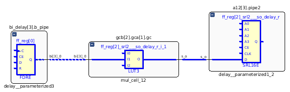

Παρατηρούμε ότι κρίσιμο μονοπάτι βρίσκεται στο κάτω δεξιά δομικό κομμάτι.
Κυρίως λόγω Net Delay.

* Logic Delay **0.58 ns**, Net Delay **1.343 ns**

# Ερωτήματα Θεωρίας

### Ι

Τα ακολουθιακά κυκλώματα με σύγχρονα σήματα ελέγχου, δρουν μόνο στην (επόμενη κάθε φορά) θετική 
ακμή του ρολογιού, ανάλογα βέβαια με την τιμή που θα έχουν πάρει τα σήματα πριν την ακμή αυτή.
Αντιθέτως στα ασύγχρονα ακολουθιακά κυκλώματα, τα σήματα ελέγχου δρουν οποιαδήποτε στιγμή 
επηρεάζοντας το κύκλωμα. Από άποψη κώδικα,διαφοροποιούνται ως εξης.

Στα σύγχρονα κυκλώματα μόνο το ρολόι μπαίνει στο sensitivity list της διαδικασίας, 
κι ως εκ τούτου αυτή ενεργοποιείται μόνο με αλλαγή στο ρολόι. Όταν διαπιστωθεί η αλλαγή αυτή, 
τότε μόνο ελέγχονται περαιτέρω τα σήματα ελέγχου για τον πλήρη καθορισμό της λειτουργίας του κυκλώματος.

Στα ασύγχρονα κυκλώματα τόσο το ρολόι, όσο και τα σήματα ελέγχου δηλώνονται στο sensitivity list της
διαδικασίας, επηρεάζοντας την οποιαδήποτε στιγμή εξίσου. Έτσι όταν κάποιο από αυτά αλλάζει, ασύγχρονα
το κύκλωμα συμπεριφέρεται αναλόγως.

### ΙΙ

Η λειτουργία της σύνθεσης παίρνει τον κώδικα σε VHDL και βγάζει κύκλωμα
αποτελούμενο από πύλες, flip flops, κτλ μαζί με τον τρόπο που συνδέονται.
Αυτό έχει διαφορά με την προσομοίωση η οποία δεν ασχολείται με το πως
θα υλοποιηθεί το κύκλωμα στο υλικό, αλλά με το πως θα συμπεριφερόταν αυτό
σε διάφορους συνδυασμούς τιμών της εισόδου.

### ΙΙΙ
Στα συνδυαστικά κυκλώματα αρκεί η παραγωγή σημάτων εισόδου. Στα ακολουθιακά κυκλώματα
πρέπει να παραχθεί και το σήμα του ρολογιού καθώς και άλλα συμπληρωματικά σήματα(reset,
enable, clear etc).
Στα συνδυαστικά κυκλώματα για να αποφανθούμε αν είναι σωστά πρέπει να εξετάσουμε
όλες τις δυνατές εισόδους. Αντιθέτως στα ακολουθιακά, καθώς αυτά έχουν μνήμη πρέπει
εκτός από όλες τις δυνατές εισόδους να εξετάζουμε διάφορες ακολουθίες αυτών των εισόδων.

### IV 

Στην περίπτωση του ερωτήματος 3α έχουμε ένα συνδυαστικό κύκλωμα ενός αθροιστή διάδοσης 
κρατουμένου (`4RCA`). Το critical path είναι τύπου είσοδος-έξοδος, είναι κατά μήκος όλου του κυκλώματος
με συνολική καθυστέρηση 5,97 ns. Το fpga καταναλώνει πόρους τύπου LUT(1%) και ΙΟ(14%).

Στην περίπτωση του ερωτήματος 3β έχουμε εφαρμόσει την τεχνική pipeline για τη δημιουργία ακολουθιακού 
`4RCA`. To critical path είναι τύπου καταχωρητής(flip-flop) - έξοςδος, με συνολική καθυστέρηση 4,076ns.
To fpga καταναλώνει πόρους τύπου LUT(1%), LUTRAM(1%), FF(1%), IO(16%) και BUFG(3%).

Παρατηρούμε, επομένως, πως στην πρώτη περίπτωση χρησιμοποιείται λιγότερο υλικό στο fpga σε σχέση με τη δεύτερη, αλλά το κύκλωμα έχει μεγαλύτερη συνολική καθυστέρηση. Αυτό γίνεται γιατί έχουμε τοποθετήσει παραπάνω καταχωρητές στα κατάλληλα σημεία ώστε να επιτύχουμε τον κατάλληλο χρονισμό του κυκλώματος. Έτσι σε κάθε κύκλο έχουμε καθυστέρηση μικρότερη κατά 31,5% !  
