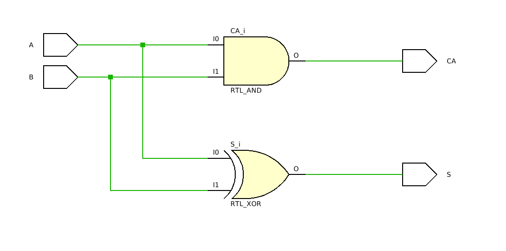

# Ερώτημα 1

Σε αυτό το ερώτημα υλοποιήθηκε συνδυαστικός ημιαθροιστής (`Half Adder`) με `dataflow` περιγραφή. 

## Κώδικας Ερωτήματος 
```vhdl
library IEEE;
use IEEE.STD_LOGIC_1164.ALL;

entity half_adder_dtf is
    Port ( A : in STD_LOGIC;
           B : in STD_LOGIC;
           S : out STD_LOGIC;
           CA : out STD_LOGIC);
end half_adder_dtf;

architecture Dataflow of half_adder_dtf is

begin

 S <= A xor B;
CA <= A and B; 

end Dataflow;
```
## Testbench 
```vhdl 
library IEEE;
use IEEE.STD_LOGIC_1164.ALL;
use IEEE.NUMERIC_STD.ALL;


entity testbench_ha_dtf is
 --    Port ( );
end testbench_ha_dtf;

architecture Behavioral of testbench_ha_dtf is

component half_adder_dtf is
  Port (A,B:in std_logic;
  S,CA: out std_logic );
end component;
--inputs
signal A: std_logic;
signal B: std_logic;
--outputs
signal CA : std_logic;
signal S : std_logic;

begin

uut: half_adder_dtf PORT MAP(A=>A,B=>B,CA=>CA,S=>S);
--Stimulus Process
stim_proc:process
begin
A<='0';
B<='0';
wait for 10 ns;
A<='0';
B<='1';

 wait for 10 ns;
A<='1';
B<='0';
 wait for 10 ns; 
 
A<='1';
B<='1';
 wait for 10 ns;

end process;

end Behavioral;
```
## RTL 


d
