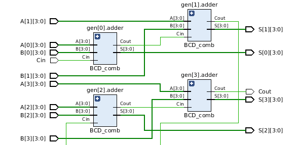
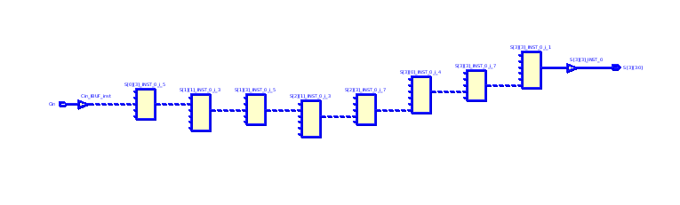
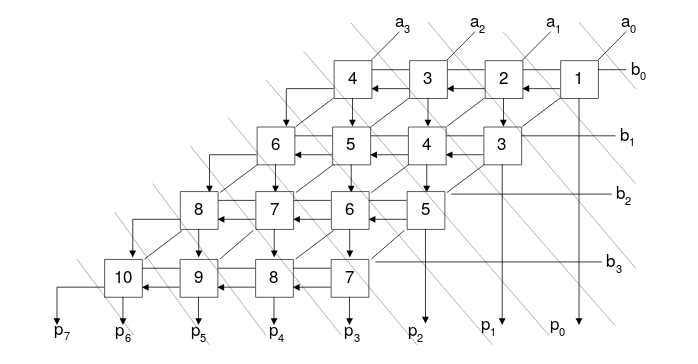
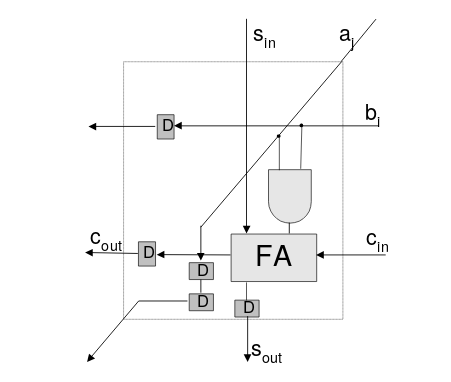
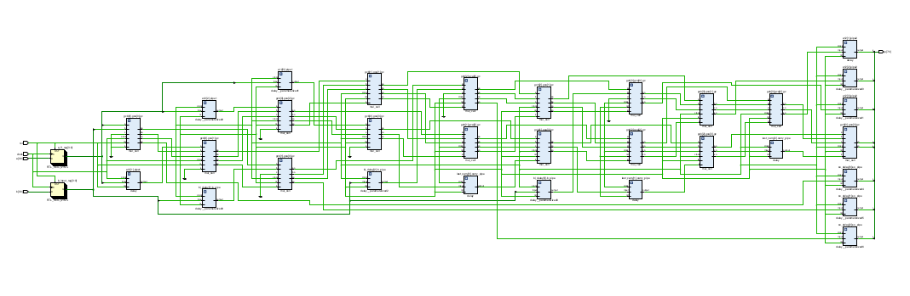
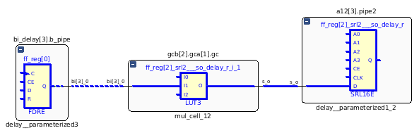

# Ζήτημα 5

Η υλοποίηση του ερωτήματος έγινε με χρήση χρήση τεσσάρων bcd full adders του ερωτήματος 4.

### Κώδικας ερωτήματος

```vhdl
library ieee;
use ieee.std_logic_1164.all;
use ieee.numeric_std.all;

package bcd_arr_pkg is
    type bcd_arr is array(3 downto 0) of std_logic_vector(3 downto 0);
end package;

library ieee;
use ieee.std_logic_1164.all;
use ieee.numeric_std.all;
use work.bcd_arr_pkg.all;

entity bcd_4pa is
port(
    A, B: in bcd_arr;
    Cin : in std_logic;
    S: out bcd_arr;
    Cout : out std_logic
);
end entity;

architecture structural of bcd_4pa is
signal C: std_logic_vector(4 downto 0);
begin
    C(0) <= Cin;
    gen: for I in 0 to 3 generate
        adder: entity work.BCD_comb port map(
            A=>A(I),
            B=>B(I),
            Cin=>C(I),
            S=>S(I),
            Cout=>C(I+1)
        );
    end generate;
    Cout <= C(4);
end structural;
```

### Testbench ερωτήματος

```vhdl
library IEEE;
use IEEE.STD_LOGIC_1164.ALL;
use ieee.numeric_std.all;


entity bcd_4pa_tb is
end bcd_4pa_tb;
use work.bcd_arr_pkg.all;

architecture Behavioral of bcd_4pa_tb is
-- inputs 
    signal A, B : bcd_arr;
    signal Cin : std_logic;
-- outputs
    signal S : bcd_arr;
    signal Cout : std_logic;
begin
    UUT: entity work.bcd_4pa port map (A=>A, B=>B, Cin=>Cin, S=>S, Cout=>Cout);
    process is
    begin
    
    Cin <= '1';
    
    A(0) <= "1000";
    A(1) <= "1001";
    A(2) <= "0100";
    A(3) <= "0001";
    
    B(0) <= "1000";
    B(1) <= "0011";
    B(2) <= "0110";
    B(3) <= "0000";
    
    wait for 1 ns;
    
    Cin <= '0';
    
    A(0) <= "1001";
    A(1) <= "1000";
    A(2) <= "1000";
    A(3) <= "1000";
    
    B(0) <= "0101";
    B(1) <= "0101";
    B(2) <= "1001";
    B(3) <= "0101";
    
    wait for 1 ns;
    
    Cin <= '0';
    
    A(0) <= "0100";
    A(1) <= "0001";
    A(2) <= "0010";
    A(3) <= "0011";
    
    B(0) <= "0111";
    B(1) <= "1001";
    B(2) <= "1000";
    B(3) <= "0111";
    
    wait for 1 ns;
    
    Cin <= '1';
    
    A(0) <= "1001";
    A(1) <= "1001";
    A(2) <= "1001";
    A(3) <= "1001";
    
    B(0) <= "1001";
    B(1) <= "1001";
    B(2) <= "1001";
    B(3) <= "1001";
    
    
    wait;
    end process; 
end Behavioral;
```

### Σχηματικό



### Αποτελέσματα υλοποίησης

* LUTs **24**
* Καθυστέρηση 15.6 ns, Λογική 5.4 ns, Δικτύου 10.2 ns




# Ζήτημα 6

Σε αυτό το ερώτημα ζητείται η σχεδίαση ενός συστολικού πολλαπλασιαστή με
διάδωση κρατουμένου.





Για την απλοποίηση της υλοποίησης σχεδιάστηκε το παραμετρικό entity delay
που είναι ουσιαστικά ένας καταχωρητής ολίσθησης.

Κάτι που δε φαίνεται στο σχήμα είναι ότι στα τελευταία δομικά στοιχεία κάθε
γραμμής, απαιτείται ένα επιπλέον flip flop για καθυστέρηση επιπλέον ενός κύκλου (σύνολο 2). 

# Κώδικας ερωτήματος

```vhdl
-- Multiplier cell
--
-- (co,so) <= (a*b) + si + ci
-- (ao,bo) <= (ai,bi)
--
library IEEE;
use IEEE.std_logic_1164.all;

entity mul_cell is
	port
	(
		ai : in std_logic;
		bi : in std_logic;
		si : in std_logic;
		ci : in std_logic;
		clock: in std_logic;
		rst: in std_logic;
		ao : out std_logic;
		bo : out std_logic;
		so : out std_logic;
		co : out std_logic
		
	);
end mul_cell;

architecture dataflow of mul_cell is
	signal ab,a_o,a2_o,b_o,s_o,c_o : std_logic;
begin
	ab <= ai and bi;
	s_o <= ab xor si xor ci;
	c_o <= (ab and si) or (ab and ci) or (si and ci);
	a_o <= ai;
	b_o <= bi;

	-- flip flops
	process (clock)
	begin
		if rising_edge(clock) then
			if rst = '1' then
				so <= '0';
				co <= '0';
				a2_o <= '0';
				ao <= '0';
				bo <= '0';
			else
				so <= s_o;
				co <= c_o;
				a2_o <= a_o; -- 2 cycles delay for a
				ao <= a2_o;
				bo <= b_o;
			end if;
		end if;
	end process;
end dataflow;

library IEEE;
use IEEE.std_logic_1164.all;

entity delay is
generic
	(
		stages : positive := 4
	);
	port (
		input: in std_logic;
		clock: in std_logic;
		rst: in std_logic;
		output: out std_logic
	);
end delay;

architecture D of delay is
signal ff: std_logic_vector(stages-1 downto 0);
begin
	output <= ff(0);
	process(clock)
	begin
		if rising_edge(clock) then
			if rst = '1' then
				ff <= (others => '0');
			else
				ff(stages-1) <= input;
				for i in 0 to stages-2 loop
					ff(i) <= ff(i+1);
				end loop;
			end if;
		end if;
	end process;
end D;

-- Unsigned Parallel Carry-Propagate Multiplier
--
-- p <= a * b;
--

library IEEE;
use IEEE.std_logic_1164.all;
entity mul_u_cp is
	generic
	(
		NA : positive := 4; -- bits of multiplier
		NB : positive := 4 -- bits of multiplier
	);
	port
	(
		a : in std_logic_vector(NA-1 downto 0);
		b : in std_logic_vector(NB-1 downto 0);
		clock: std_logic;
		rst: std_logic;
		p : out std_logic_vector(NA+NB-1 downto 0)
	);
end mul_u_cp;

architecture structural of mul_u_cp is
	subtype a_word is std_logic_vector(NA-1 downto 0);
	type a_word_array is array(natural range <>) of a_word;
	signal b_input: std_logic_vector(NB-1 downto 0);
	signal a_ff: std_logic_vector(NA-1 downto 0);
	signal ai,ao,bi,bo,si,so,ci,co,b_delay,s_delay,b2_delay,s2_delay,p_delay
	: a_word_array(NB-1 downto 0);
begin
-- cell generation
	gcb:for i in 0 to NB-1 generate
		gca:for j in 0 to NA-1 generate
			gc:entity work.mul_cell port map
			(
				ai => ai(i)(j),
				bi => bi(i)(j),
				si => si(i)(j),
				ci => ci(i)(j),
				clock => clock,
				rst => rst,
				ao => ao(i)(j),
				bo => bo(i)(j),
				so => so(i)(j),
				co => co(i)(j)
			);
		end generate;
	end generate;

-- intermediate wires generation
	gasw:for i in 1 to NB-1 generate
		ai(i) <= ao(i-1);
		si(i)(NA-2 downto 0) <= so(i-1)(NA-1 downto 1);
	end generate;

	gbciw: for i in 0 to NB-1 generate
		gbcjw:
		for j in 1 to NA-1 generate
			bi(i)(j) <= bo(i)(j-1);
			ci(i)(j) <= co(i)(j-1);
		end generate;
	end generate;

-- input connections
	
	gsi: si(0) <= (others => '0');
	
	gci:for i in 0 to NB-1 generate
		ci(i)(0) <= '0';
	end generate;

-- output connections

	-- flip flops
	
	a12: for i in 1 to NA-1 generate
		pipe1: entity work.delay 
		generic map(i) port map(input => a_ff(i),output => ai(0)(i),clock => clock,rst => rst);
		pipe2: entity work.delay
		generic map(i) port map(input => so(NB-1)(NA-i-1),output => p(NA+NB-2-i),clock => clock, rst => rst);
	end generate;


	p(NA+NB-1 downto NA+NB-2) <= co(NB-1)(NA-1) & so(NB-1)(NA-1);

	-- zero delay
	ai(0)(0) <= a_ff(0);
	bi(0)(0) <= b_input(0);

	bi_delay:for i in 1 to NB-1 generate
		b_pipe: entity work.delay 
		generic map(2*i) port map(input => b_input(i),output => bi(i)(0),clock => clock,rst => rst);
	end generate;

	so_delay:for i in 0 to NB-2 generate
		so_pipe:entity work.delay 
		generic map(9-2*i) port map(input => so(i)(0),output => p(i),clock => clock,rst => rst);
	end generate;

	last_carry:for i in 0 to NB-2 generate
		carry_pipe:entity work.delay 
		generic map(1) port map(input => co(i)(NA-1),output => si(i+1)(NA-1),clock => clock,rst => rst);
	end generate;
	
	process (clock)
	begin
		if rising_edge(clock) then
			if rst = '1' then
				a_ff <= (others => '0');
				b_input <= (others => '0');
			else
				-- flip flop for input
				a_ff <= a; -- TODO

				-- flip flop for input
				b_input <= b;
			end if;
		end if;
	end process;
end structural;

library IEEE;
use IEEE.std_logic_1164.all;
use IEEE.std_logic_unsigned.all;
use std.textio.all;

entity tb_mul_u_cp is
	generic
	(
		NA : positive := 4;
		NB : positive := 4
	);
end tb_mul_u_cp;

architecture tb_arch of tb_mul_u_cp is
	component mul_u_cp
		generic
		(
			NA : positive := 4;
			NB : positive := 4
		);
		port
		(
			a : in std_logic_vector(NA-1 downto 0);
			b : in std_logic_vector(NB-1 downto 0);
			p : out std_logic_vector(NA+NB-1 downto 0)
		);
	end component;
	signal a : std_logic_vector(NA-1 downto 0);
	signal b : std_logic_vector(NB-1 downto 0);
	signal p_cp : std_logic_vector(NA+NB-1 downto 0);
	constant TIME_STEP : time := 1 ns;
	constant clock_period: time := 10 ns;
    constant clock_num: integer := 256;
	signal clock,rst: std_logic;
begin

	str:
	entity work.mul_u_cp generic map(NA,NB) port map (a,b,clock,rst,p_cp);
	comment1:if false generate
	process
	begin
	    --rst <= '1';
	    
		wait for clock_period;
		rst <= '0';
		a <= "1111";
		b <= "1111";
		wait for clock_period;
		wait for clock_period;
		rst <= '0';
		a <= "0000";
		b <= "0000";
		wait for clock_period;
		rst <= '0';
		a <= "1111";
		b <= "1111";
		wait for clock_period;
		wait for clock_period;
		rst <= '0';
		a <= "0000";
		b <= "0000";
		wait for clock_period;
		wait;
	end process;
clocking: process
	begin
		for i in 0 to clock_num loop
			clock <= '1', '0' after clock_period / 2;
			wait for clock_period;
		end loop;
	wait;
	end process;
	end generate comment1;
	
	comment2:if true generate
	process
		function reportline(a,b,p:in std_logic_vector)
		return string is
			variable report_line : line;
			variable return_str : string(1 to 160);
		begin
			write(report_line,conv_integer(a));
			write(report_line,string'(" * "));
			write(report_line,conv_integer(b));
			write(report_line,string'(" = "));
			write(report_line,conv_integer(a)*conv_integer(b));
			write(report_line,string'(" /= "));
			write(report_line,conv_integer(p));
			for i in report_line'range loop
				return_str(i) := report_line(i);
			end loop;
			return return_str;
		end reportline;
	begin
		clock <= '0';
		rst <= '0';
-- create new test vector
		if a(0) = 'U' then
-- initialize a and b if uninitialized
			a <= (others => '0');
			b <= (others => '0');
		else
			if (a = 2**NA-1) then
				assert (b /= 2**NB-1)
-- end if b is maximum
				report "End of simulation"
				severity failure;
-- increase b if a is maximum
				b <= b + 1;
			end if;
			a <= a + 1;
-- increase a
		end if;
		wait for TIME_STEP/2;
		clock <= '1';
		wait for TIME_STEP/2;
		clock <= '0';
-- test the new vector
		assert (p_cp = a*b)
		report reportline(a,b,p_cp)
		severity error;
	end process;
	end generate comment2;
end tb_arch;
```

### Σχηματικό



### Αποτελέσματα σύνθεσης και υλοποίησης

* Περίοδος ρολογιού **2.1 ns** δηλαδή **476 MHz**
* Slice LUTs 33, Slices 26, Slice Registers 98

### Critical Path



Παρατηρούμε ότι κρίσιμο μονοπάτι βρίσκεται στο κάτω δεξιά δομικό κομμάτι.
Κυρίως λόγω Net Delay.

* Logic Delay **0.58 ns**, Net Delay **1.343 ns**

# Ερωτήματα Θεωρίας

### Ι

Τα ακολουθιακά κυκλώματα με σύγχρονα σήματα ελέγχου, δρουν μόνο στην ακμή
του ρολογιού. Αντιθέτως στα ασύγχρονα, τα σήματα ελέγχου δρουν οποιαδήποτε στιγμή.

### ΙΙ

Η λειτουργία της σύνθεσης παίρνει τον κώδικα σε VHDL και βγάζει κύκλωμα
αποτελούμενο από πύλες, flip flops, κτλ μαζί με τον τρόπο που συνδέονται.
Αυτό έχει διαφορά με την προσομοίωση η οποία δεν ασχολείται με το πως
θα υλοποιηθεί το κύκλωμα στο υλικό.

### ΙΙΙ

Στα συνδυαστικά κυκλώματα για να αποφανθούμε αν είναι σωστά πρέπει να εξετάσουμε
όλες τις δυνατές εισόδους. Αντιθέτως στα ακολουθιακά, καθώς αυτά έχουν μνήμη πρέπει
εκτός από όλες τις δυνατές εισόδους να εξετάζουμε διάφορες ακολουθίες αυτών των εισόδων.

### IV 

Στην περίπτωση του ερωτήματος 3α έχουμε ένα συνδυαστικό κύκλωμα ενός αθροιστή διάδοσης 
κρατουμένου (`4RCA`). Το critical path είναι τύπου είσοδος-έξοδος, είναι κατά μήκος όλου του κυκλώματος
με συνολική καθυστέρηση 5,97 ns. Το fpga καταναλώνει πόρους τύπου LUT(1%) και ΙΟ(14%).

Στην περίπτωση του ερωτήματος 3β έχουμε εφαρμόσει την τεχνική pipeline για τη δημιουργία ακολουθιακού 
`4RCA`. To critical path είναι τύπου καταχωρητής(flip-flop) - έξοςδος, με συνολική καθυστέρηση 4,076ns.
To fpga καταναλώνει πόρους τύπου LUT(1%), LUTRAM(1%), FF(1%), IO(16%) και BUFG(3%).

Παρατηρούμε, επομένως, πως στην πρώτη περίπτωση χρησιμοποιείται λιγότερο υλικό στο fpga σε σχέση με τη δεύτερη, αλλά το κύκλωμα έχει μεγαλύτερη συνολική καθυστέρηση. Αυτό γίνεται γιατί έχουμε τοποθετήσει παραπάνω καταχωρητές στα κατάλληλα σημεία ώστε να επιτύχουμε τον κατάλληλο χρονισμό του κυκλώματος. Έτσι σε κάθε κύκλο έχουμε καθυστέρηση μικρότερη κατά 31,5% !  
